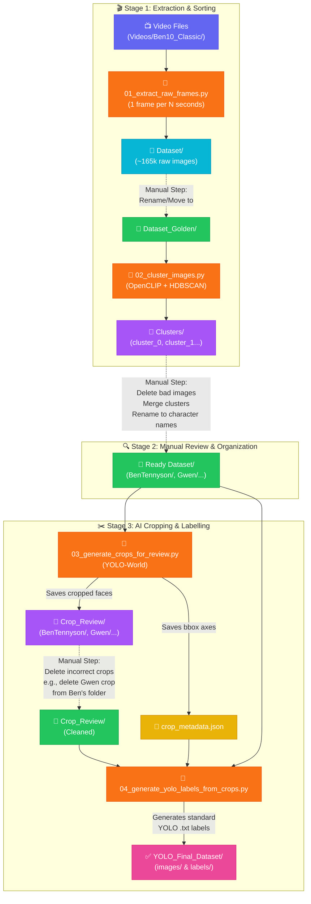

<div align="center">

# 🖼️ YOLO Dataset Creation Guide

### *From raw video frames to a high-quality object detection dataset*

[](https://python.org)
[](https://github.com/ultralytics/ultralytics)

---

*Build a hyper-accurate computer vision dataset by extracting frames, visually clustering them, cropping characters with AI, and manually reviewing the crops to generate perfect labels.*

</div>

---

## 📑 Table of Contents

- [Overview](#-overview)
- [The Big Picture Workflow](#-the-big-picture-workflow)
- [Step 1: Frame Extraction](#-step-1-frame-extraction)
- [Step 2: AI Clustering](#-step-2-ai-clustering)
- [Step 3: Character Cropping & Metadata](#-step-3-character-cropping--metadata)
- [Step 4: Final YOLO Label Generation](#-step-4-final-yolo-label-generation)
- [Troubleshooting & Tips](#-troubleshooting--tips)

---

## 🔭 Overview

Training an accurate YOLO model for character recognition in animation requires a pristine dataset where characters are correctly boxed and labeled, while preserving the background.

This process handles the entire pipeline using **four scripts** located right here in the `Creating Dataset/` folder. The workflow heavily utilizes AI to do the heavy lifting (clustering and zero-shot bounding boxes) while relying on you for quick, visual manual review to ensure 100% accuracy.

---

## 🧩 The Big Picture Workflow



---

## 🎬 Step 1: Frame Extraction

**Script:** `01_extract_raw_frames.py`

This script rips frames from your episodes to build the raw image pool.

### How it works:
1. It looks for video files in `Videos/Ben10_Classic/`.
2. It extracts 1 frame every few seconds from every episode.
3. Saves all images to the `Dataset/` folder.

### What you need to do:
1. Ensure your videos are placed correctly in `AutomationPipeline-main/Videos/Ben10_Classic/`.
2. Run the script:
   ```bash
   python 01_extract_raw_frames.py
   ```
3. **Important:** When extraction is complete, rename the `Dataset/` folder to `Dataset_Golden/` (or copy the best images there) before proceeding to Step 2.

> [!CAUTION]
> This step can generate over 150,000 images and consume gigabytes of storage space. Ensure you have enough disk space before running!

---

## 🤖 Step 2: AI Clustering

**Script:** `02_cluster_images.py`

Sorting 150,000 images manually is impossible. This script uses AI (OpenCLIP) to group visually similar images together into clusters.

### How it works:
1. Reads all images from `Dataset_Golden/`.
2. Generates visual embeddings for each image.
3. Groups them into ~100 folders named `cluster_0`, `cluster_1`, inside the `Clusters/` directory.

### What you need to do:
1. Run the script:
   ```bash
   python 02_cluster_images.py
   ```
2. **The Manual Labor:** Open the `Clusters/` folder in your file explorer.
   * Go into `cluster_0`. If it's mostly "Ben Tennyson", delete the random bad images inside it.
   * Rename the folder from `cluster_0` to `BenTennyson`.
   * If you find another cluster that is also Ben, clean it out, and drag its images into your renamed `BenTennyson` folder.
   * Delete clusters that are just random backgrounds or junk.
3. Once you have nice, clean folders named after your characters (e.g., ~32 character folders), move all those character folders into a new directory called **`Ready Dataset/`** in the project root.

> [!TIP]
> Keep your folder names identical to the character names used in your `config/show_config.yaml` to ensure maximum compatibility with the rest of the pipeline!

---

## ✂️ Step 3: Character Cropping & Metadata

**Script:** `03_generate_crops_for_review.py`

Just because an image is in the `BenTennyson` folder doesn't mean Ben is the *only* character in the image. If Gwen is standing next to him, we don't want the model learning that Gwen's face = Ben.

### How it works:
1. The script scans the `Ready Dataset/` folder.
2. It uses a generic YOLO-World model to detect *any* character in the image.
3. It crops out every detected character and saves them in `Ready Dataset/Crop_Review/`.
4. **Crucially:** It saves the exact X,Y bounding box coordinates of that crop to `crop_metadata.json`.

### What you need to do:
1. Run the script:
   ```bash
   python 03_generate_crops_for_review.py
   ```
2. **The Final Review:** Open the new `Ready Dataset/Crop_Review/` folder.
   * Open the `BenTennyson` folder inside it.
   * You will see tightly cropped faces/bodies.
   * If you see a crop of Gwen, Kevin, or a random alien in this folder—**delete that specific image**.
   * Leave *only* the genuine crops of Ben Tennyson. Do this for all folders.

> [!NOTE]
> Don't worry about the backgrounds being missing in these crops. We are NOT training the model on these cropped images. This is just for your visual review!

---

## 🏷️ Step 4: Final YOLO Label Generation

**Script:** `04_generate_yolo_labels_from_crops.py`

This script closes the loop, merging your manual review with the original full-frame images.

### How it works:
1. It looks at the `Crop_Review/` folder. 
2. If a cropped image still exists on disk, it assumes you approved it!
3. It reads the bounding box coordinates for that approved crop from `crop_metadata.json`.
4. It creates a `.txt` label file for the **original, full-background image**.
5. It exports the final images and labels to `YOLO_Final_Dataset/` in the standard YOLO format (`images/train/`, `labels/train/`, etc.).

### What you need to do:
1. Run the script:
   ```bash
   python 04_generate_yolo_labels_from_crops.py
   ```
2. You are done! Your dataset is now located in `YOLO_Final_Dataset/` and is ready for ultralytics YOLO training.

> [!IMPORTANT]
> Because of this workflow, if an original image had both Ben and Gwen, but it was stored in the `BenTennyson` folder, the final label file will *only* have a bounding box drawn around Ben. Gwen will be treated as background, which is exactly what we want for robust model training!

---

## 🛠️ Troubleshooting & Tips

- **Missing OpenCLIP/HDBSCAN:** If step 2 fails, you need to install the clustering libraries:
  `pip install open_clip_torch hdbscan scikit-learn`
- **Low YOLO-World Confidence:** If Step 3 misses some characters, you can open `03_generate_crops_for_review.py` and tweak the generic classes on line 30 to better fit your show's art style (e.g., adding "anime character" or "superhero").
- **Accidental Deletions:** Always keep a backup of `Ready Dataset/` before running Step 3, just in case you need to start the cropping process over again.

</div>
