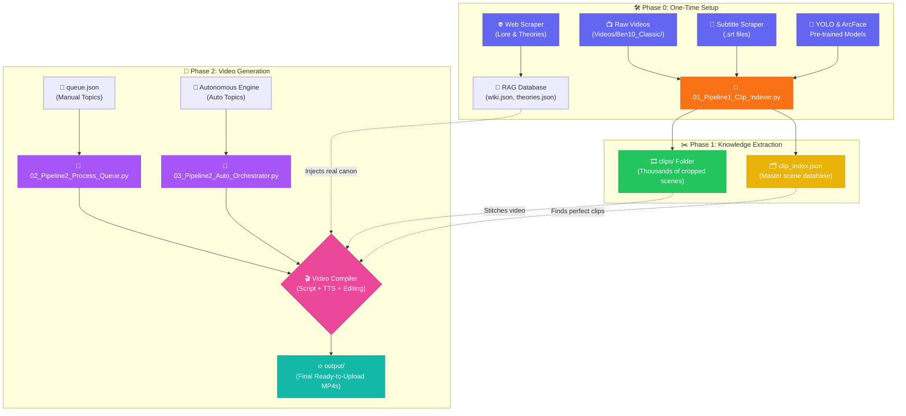

<div align="center">

# 🎬 The Master Guide — End-to-End Autonomous Video Pipeline

### *From blank folders to fully automated, AI-generated YouTube Shorts*

[](#)
[](#)

---

*This is the ultimate roadmap. Follow these steps exactly to transform raw video episodes into viral, lore-accurate short-form videos with AI-generated scripts and voiceovers.*

</div>

---

## 📑 Table of Contents

- [Phase 0: The One-Time Setup (Data Collection)](#-phase-0-the-one-time-setup-data-collection)
  - [1. Lore & Web Scraping](#1-lore--web-scraping)
  - [2. Download Videos](#2-download-videos)
  - [3. Download Subtitles](#3-download-subtitles)
  - [4. AI Models & Dataset Training](#4-ai-models--dataset-training)
- [Phase 1: Knowledge Extraction](#-phase-1-knowledge-extraction)
  - [5. Pipeline 1: Master Clip Generation](#5-pipeline-1-master-clip-generation)
- [Phase 2: Video Generation](#-phase-2-video-generation)
  - [6A. Manual Topic Queue Generation](#6a-manual-topic-queue-generation)
  - [6B. Fully Autonomous Orchestrator](#6b-fully-autonomous-orchestrator)
- [Configuration & Settings](#%EF%B8%8F-configuration--settings)

---

## 🗺️ The Architecture



---

## 🛠️ Phase 0: The One-Time Setup (Data Collection)

Before the AI can make videos, it needs food. You only need to do these steps **once**.

### 1. Lore & Web Scraping
To prevent the AI from hallucinating fake facts, we scrape the real wiki.
* **Instruction Guide:** [Read the Web Scraping Guide here](./Web_Scrapping/instruction.md)
* **Goal:** Run the scripts in that folder to generate `wiki.json` and `theories.json`.
* *(One-time process only)*

### 2. Download Videos
The pipeline needs the raw source material.
* **Goal:** Download Ben 10 Classic Seasons 1 to 4 from your preferred source.
* **Location:** Place them directly in the root directory like this:
  `AutomationPipeline/Videos/Season_1/S01E01.mp4`
* *(One-time process only)*

### 3. Download Subtitles
To map dialogue to video frames, we need `.srt` files.
* **Instruction Guide:** [Read the Subtitle Scraper Guide here](./Subtitle_Scrapper/instruction.md)
* **Goal:** Use the automated script in that folder to fetch perfect subtitles for all the videos you downloaded in Step 2.
* *(One-time process only)*

### 4. AI Models & Dataset Training
The pipeline requires pre-trained visual models to "see" characters in the video.
* **Existing Models:** Your models are already set up! The YOLO weights are in the `yolo_wt/` folder, and the ArcFace weights (`.pt` / `.npz`) are in the root directory.
* **Want to train your own?** If you ever want to fine-tune or train from scratch, read the [Dataset Creation Guide here](./Creating%20Dataset/instruction.md).
* **Want the raw dataset?** Download the pre-annotated dataset from Kaggle: [Ben 10 Object Detection Dataset](https://www.kaggle.com/datasets/rishavraj1232/ben10-dataset-for-object-detectionyolo-annotated/data?select=YOLO_Final_Dataset)

---

## ✂️ Phase 1: Knowledge Extraction

This is the most computationally heavy part of the project. The AI will watch every single episode, detect characters, embed subtitles, and chunk the video into thousands of micro-clips.

### 5. Pipeline 1: Master Clip Generation

I have placed the master script directly in this folder for your convenience. 

**Script:** [`01_Pipeline1_Clip_Indexer.py`](./01_Pipeline1_Clip_Indexer.py)

1. Open your terminal in this folder and run:
   ```bash
   python 01_Pipeline1_Clip_Indexer.py
   ```
2. **What happens:** It will process every video, run YOLO/ArcFace detection, and slice the videos into the `clips/` folder.
3. **Outputs:** You will get two critical databases: `clip_index.json` and `episode_index.json`.

> [!CAUTION]
> **BACKUP YOUR DATA!** This process takes a massive amount of time. Once it finishes successfully, **immediately make a backup copy** of `clip_index.json`. If this file gets corrupted or deleted, you have to run Pipeline 1 all over again!

---

## 🚀 Phase 2: Video Generation

You are finally ready to generate videos! You have two ways to do this: Manual (You write the idea, AI makes the video) or Autonomous (AI comes up with the idea and makes the video).

### 6A. Manual Topic Queue Generation

If you have a specific video idea in mind, you can force the AI to make a video about it using a queue system.

1. Open the file `queue.json` in the root directory.
2. Add your topics exactly like this:
   ```json
   [
     {
       "topic": "The Omnitrix pod intentionally hunted Ben down in the pilot.",
       "hook": "Did you miss the terrifying proof that the Omnitrix pod was actually hunting Ben?",
       "answer_angle": "Analyze the meteor crash in the Season 1 pilot 'And Then There Were 10.' Point out how the pod aggressively changed its trajectory mid-air...",
       "difficulty": "medium"
     }
   ]
   ```
   *(You can add as many topics inside the `[]` brackets as you want).*

3. Run the processing script:
   **Script:** [`02_Pipeline2_Process_Queue.py`](./02_Pipeline2_Process_Queue.py)
   ```bash
   python 02_Pipeline2_Process_Queue.py
   ```
4. Check the `output/` folder for your finished MP4!

---

### 6B. Fully Autonomous Orchestrator

Want the pipeline to run completely hands-off? The Orchestrator will invent topics based on your models, write scripts, and render videos automatically.

**Script:** [`03_Pipeline2_Auto_Orchestrator.py`](./03_Pipeline2_Auto_Orchestrator.py)

Here are the commands you can use:

**1. Full Autonomous Pipeline (Specific Topic):**
```bash
python 03_Pipeline2_Auto_Orchestrator.py --topic "Why Ben's Omnitrix is the Most Powerful Device"
```

**2. Topic Mining (Let AI invent ideas):**
```bash
python 03_Pipeline2_Auto_Orchestrator.py --phase topic_mine --count 5
```

**3. Run Everything Automatically:**
```bash
python 03_Pipeline2_Auto_Orchestrator.py --phase all --auto-approve
```

**4. Resume After a Crash:**
```bash
python 03_Pipeline2_Auto_Orchestrator.py --resume
```

> [!TIP]
> You can also check the bottom of the main `README.md` file in the root directory for even more advanced Orchestrator commands and control flags!

---

## ⚙️ Configuration & Settings

You can customize the brain and voice of the AI at any time by editing `config/pipeline_config.yaml`.

* **The Brain (Script Generation):**
  By default, the pipeline uses local **Ollama 8B**. If you want faster/smarter generations, open `pipeline_config.yaml` and change the engine name from `ollama` to `gemini`. 
  *(Make sure you have your Gemini API key saved inside your `.env` file!)*

* **The Voice (TTS):**
  By default, the pipeline uses **Kokoro**. If you want to switch to a different free engine or change the voice profile, you can configure this directly inside `pipeline_config.yaml`.

---

<div align="center">
<b>Congratulations! If you've made it this far, you have a fully autonomous AI content agency running on your local machine. Enjoy your output! 🎬</b>
</div>
