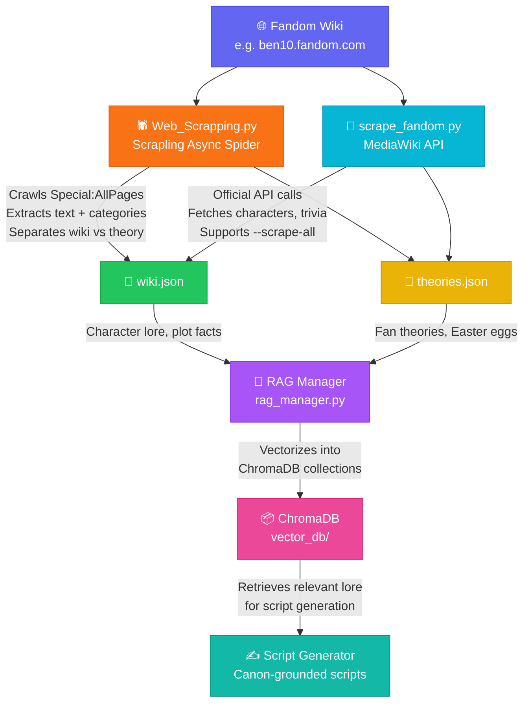
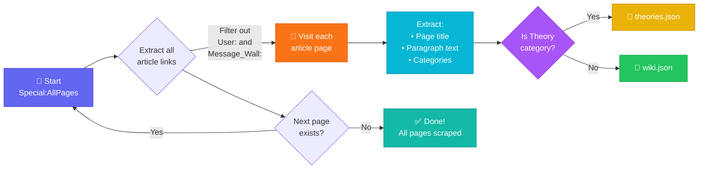
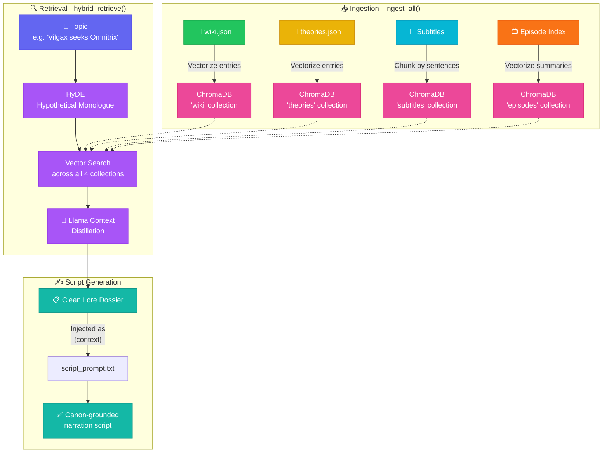

<div align="center">

# 🌐 Web Scraping Guide — Fandom Wiki Crawler

### *Automatically scrape character lore, theories, and trivia to power your AI knowledge base*

[](https://python.org)
[](https://github.com/D4Vinci/Scrapling)
[](https://www.fandom.com)

---

*Crawl an entire Fandom wiki. Build a lore database. Let AI write scripts grounded in real canon.*

</div>

---

## 📑 Table of Contents

- [Overview](#-overview)
- [How It Works — The Big Picture](#-how-it-works--the-big-picture)
- [The Web Scraper Script](#-the-web-scraper-script-web_scrappingpy)
- [The API Scraper (Alternative)](#-the-api-scraper-alternative-scrape_fandompy)
- [Output Files — Where Data Goes](#-output-files--where-data-goes)
- [JSON Data Structure](#-json-data-structure)
- [How the Pipeline Consumes This Data](#-how-the-pipeline-consumes-this-data)
- [Configuration & Path Setup](#%EF%B8%8F-configuration--path-setup)
- [Quick Start](#-quick-start)
- [Troubleshooting](#-troubleshooting)

---

## 🔭 Overview

Your AI pipeline generates YouTube Shorts scripts about a show's lore and hidden details. To write **accurate, canon-grounded scripts**, it needs a knowledge base of real facts from the show's universe.

This web scraping tool automatically crawls the **Fandom Wiki** for your show and exports two structured JSON files:

| Output File | Contains | Used For |
|:------------|:---------|:---------|
| `wiki.json` | Character bios, plot summaries, canonical facts | Grounding scripts in real lore |
| `theories.json` | Fan theories, trivia, hidden details, Easter eggs | Inspiring viral script topics |

These files feed directly into the **RAG (Retrieval-Augmented Generation)** engine, which retrieves relevant lore when generating scripts — ensuring Ollama never hallucinates fake canon.

---

## 🧩 How It Works — The Big Picture



---

## 🕷️ The Web Scraper Script (`Web_Scrapping.py`)

**Location:** `How To Use This Project/Web_Scrapping/Web_Scrapping.py`

This is an **async spider** built with [Scrapling](https://github.com/D4Vinci/Scrapling) that crawls the entire Fandom wiki from end to end.

### 🔄 Crawl Flow



### ⚙️ Configuration

Open `Web_Scrapping.py` and modify line **7** to point to your show's wiki:

```python
# ── CONFIGURE THIS ────────────────────────────────────────────────
start_urls = ["https://ben10.fandom.com/wiki/Special:AllPages"]
#              ^^^^^^^^^^^^^^^^^^^^^^^^
#              Change to YOUR show's Fandom wiki URL
```

#### Examples for Different Shows

| Show | `start_urls` Value |
|:-----|:-------------------|
| Ben 10 | `["https://ben10.fandom.com/wiki/Special:AllPages"]` |
| Rick and Morty | `["https://rickandmorty.fandom.com/wiki/Special:AllPages"]` |
| Avatar | `["https://avatar.fandom.com/wiki/Special:AllPages"]` |
| Dragon Ball | `["https://dragonball.fandom.com/wiki/Special:AllPages"]` |
| One Piece | `["https://onepiece.fandom.com/wiki/Special:AllPages"]` |

### 📦 Dependencies

```bash
pip install scrapling
```

### ▶️ Run

```bash
python Web_Scrapping.py
```

> [!NOTE]
> Large wikis (1000+ pages) may take **30–60 minutes** to fully crawl. The script processes pages asynchronously for speed, but Fandom's servers may throttle requests. Be patient.

### 📄 Output

The script saves two files **in the current working directory**:

| File | Description |
|:-----|:------------|
| `wiki.json` | All general wiki articles (characters, locations, episodes, items, etc.) |
| `theories.json` | Pages categorized as "Theories" or found under `Theory:` namespace |

> [!IMPORTANT]
> After scraping, you **must move** these files to `topics/wiki.json` and `topics/theories.json` inside your project root so the pipeline can find them. See [Configuration & Path Setup](#%EF%B8%8F-configuration--path-setup) below.

---

## 🔌 The API Scraper (Alternative — `scrape_fandom.py`)

**Location:** `scripts/scrape_fandom.py`

This is an **alternative approach** that uses the **official MediaWiki API** instead of HTML scraping. It is more reliable, more respectful of server load, and integrates directly with the pipeline's config system.

### Key Differences

| Feature | `Web_Scrapping.py` (Spider) | `scrape_fandom.py` (API) |
|:--------|:---------------------------|:------------------------|
| Method | HTML scraping via Scrapling | Official MediaWiki API |
| Speed | Fast (async) | Moderate (1.5s delay per page) |
| Reliability | May break if HTML structure changes | Stable (API is versioned) |
| Config | Hardcoded URL in script | Reads from `pipeline_config.yaml` |
| Resume | No resume support | ✅ Auto-resumes from last page |
| Auto-save | Saves at the end | ✅ Checkpoints every 50 pages |
| Output Path | Current directory | Directly into `topics/` folder |

### ▶️ Run the API Scraper

```bash
# Default mode: scrapes theory pages + character category + core lore pages
python scripts/scrape_fandom.py --url https://ben10.fandom.com/api.php

# Scrape specific pages only
python scripts/scrape_fandom.py --url https://ben10.fandom.com/api.php \
    --core-pages "Ben Tennyson" "Vilgax" "Omnitrix" "Dr. Animo"

# Nuclear option: scrape EVERY page on the entire wiki
python scripts/scrape_fandom.py --url https://ben10.fandom.com/api.php --scrape-all
```

> [!WARNING]
> The `--scrape-all` flag on large wikis (e.g., One Piece with 15,000+ pages) can take **several hours**. The script auto-saves every 50 pages, so you can safely interrupt and resume later.

### 🧠 Smart Theory Detection

The API scraper doesn't just dump raw text. It intelligently extracts **theory-relevant sections** from each page by scanning for these HTML headers:

- `Trivia`
- `Theories`
- `Notes`
- `Behind the Scenes`
- `Cultural References`
- `Continuity`
- `Allusions`
- `Easter Eggs`

Content under these headers goes into `theories.json`. Everything else goes into `wiki.json`.

---

## 📂 Output Files — Where Data Goes

Both scrapers produce the same two output files. The pipeline expects them at these **exact locations**:

```
AutomationPipeline-main/
├── topics/
│   ├── wiki.json           ← All character lore, episode info, canonical facts
│   └── theories.json       ← Fan theories, trivia, Easter eggs, behind-the-scenes
```

These paths are defined in `config/pipeline_config.yaml`:

```yaml
paths:
  theories_db: "./topics/theories.json"    # ← Fan theories database
  wiki_db: "./topics/wiki.json"            # ← Wiki lore database
```

---

## 📋 JSON Data Structure

### `wiki.json` — Canonical Lore Database

The file stores a mapping of **page title → extracted text content**:

```json
{
  "Ben Tennyson": "Benjamin Kirby Tennyson is the titular protagonist of the Ben 10 franchise. He first found the Omnitrix at the age of 10 while on a summer vacation with his grandfather Max and cousin Gwen...",
  "Omnitrix": "The Omnimatrix, better known as the Omnitrix, is a watch-like device that attached to Ben Tennyson's wrist and is the central element of the Ben 10 franchise...",
  "Vilgax": "Vilgax is an intergalactic alien warlord and conqueror, and the main antagonist of the Ben 10 franchise...",
  "Bellwood": "Bellwood is a city in the United States and the hometown of Ben Tennyson...",
  "...": "..."
}
```

### `theories.json` — Fan Theories & Trivia Database

The file stores a mapping of **section title → extracted theory/trivia text**:

```json
{
  "Ben Tennyson - Trivia": "Ben's original design by Dave Johnson showed him with a differently shaped head. The creators considered making Ben a girl at one point...",
  "Omnitrix - Theories": "Some fans theorize that the Omnitrix timeout function is actually a quarantine protocol to prevent alien DNA from permanently overwriting Ben's human genome...",
  "Ghostfreak - Behind the Scenes": "Ghostfreak's escape from the Omnitrix was planned since Season 1. The animators hid subtle foreshadowing in earlier episodes...",
  "...": "..."
}
```

> [!TIP]
> The `Web_Scrapping.py` spider outputs data in **list format** (`[{title, url, content, categories}, ...]`), while `scrape_fandom.py` outputs in **dictionary format** (`{"title": "content", ...}`). The RAG Manager handles **both formats** automatically — no conversion needed.

---

## 🧠 How the Pipeline Consumes This Data

Once `wiki.json` and `theories.json` are in place, here is exactly how the AI pipeline uses them:



The key function chain:
1. **`rag_manager.py → ingest_all()`** — Reads both JSON files and vectorizes every entry into ChromaDB
2. **`rag_manager.py → hybrid_retrieve(topic)`** — Searches all 4 collections (subtitles, episodes, wiki, theories) for relevant context
3. **`script_verifier.py → generate_verified_script()`** — Injects the retrieved lore dossier into the script prompt as `{context}`

---

## ⚙️ Configuration & Path Setup

### Step 1: Verify output paths in `pipeline_config.yaml`

Open `config/pipeline_config.yaml` and confirm these paths:

```yaml
paths:
  theories_db: "./topics/theories.json"    # ← Must point to your theories file
  wiki_db: "./topics/wiki.json"            # ← Must point to your wiki file
  vector_db_dir: "./vector_db"             # ← Where ChromaDB stores vectorized data
```

### Step 2: Move scraped files to the correct location

If you used `Web_Scrapping.py` (which saves to the current directory), move the output files:

```bash
# Create the topics directory if it doesn't exist
mkdir -p topics/

# Move the scraped files
mv wiki.json topics/wiki.json
mv theories.json topics/theories.json
```

> [!CAUTION]
> If `topics/wiki.json` or `topics/theories.json` already exist from a previous scrape, the `scrape_fandom.py` API scraper will **merge** new data with existing data (preserving old entries). The `Web_Scrapping.py` spider will **overwrite** them. Be careful not to lose data from a previous crawl.

### Step 3: Customize for your show (Web_Scrapping.py)

Edit line 7 in `Web_Scrapping.py`:

```python
# Change this URL to your show's Fandom wiki
start_urls = ["https://YOUR_SHOW.fandom.com/wiki/Special:AllPages"]
```

### Step 3 (Alt): Customize for your show (scrape_fandom.py)

Pass the API URL as a command-line argument:

```bash
python scripts/scrape_fandom.py --url https://YOUR_SHOW.fandom.com/api.php
```

And optionally update the `core_lore_pages` list inside `scrape_fandom.py` (line 221) to include your show's most important characters:

```python
core_lore_pages = [
    "Ben Tennyson", "Gwen Tennyson", "Max Tennyson",
    "Vilgax", "Dr. Animo", "Ghostfreak", "Omnitrix",
    "Kevin Levin", "Hex", "Charmcaster"
]
```

---

## 🚀 Quick Start

### Option A: Scrapling Spider (simple, fast)

```bash
# 1. Install dependency
pip install scrapling

# 2. Edit the start URL in the script
#    Open Web_Scrapping.py → change start_urls to your show's wiki

# 3. Run the spider
cd "How To Use This Project/Web_Scrapping/"
python Web_Scrapping.py

# 4. Move output files to the pipeline's expected location
mv wiki.json ../../topics/wiki.json
mv theories.json ../../topics/theories.json

# 5. Verify
echo "Wiki entries:" && python -c "import json; print(len(json.load(open('../../topics/wiki.json'))))"
echo "Theory entries:" && python -c "import json; print(len(json.load(open('../../topics/theories.json'))))"
```

### Option B: API Scraper (recommended — resumable, auto-saves)

```bash
# 1. Install dependencies
pip install requests beautifulsoup4

# 2. Run with your show's API URL
python scripts/scrape_fandom.py --url https://ben10.fandom.com/api.php

# 3. Output is saved directly to topics/wiki.json and topics/theories.json
#    (No manual file moving needed!)

# 4. Verify
cat topics/wiki.json | python -c "import json,sys; print(f'Wiki: {len(json.load(sys.stdin))} entries')"
cat topics/theories.json | python -c "import json,sys; print(f'Theories: {len(json.load(sys.stdin))} entries')"
```

---

## 🔧 Troubleshooting

<details>
<summary><b>❓ Spider exits immediately with 0 pages</b></summary>

- The Fandom wiki URL might be wrong. Visit `https://YOUR_SHOW.fandom.com/wiki/Special:AllPages` in your browser first to confirm it loads.
- Some wikis use a different URL format (e.g., `https://YOUR-SHOW.fandom.com` vs `https://yourshow.fandom.com`).

</details>

<details>
<summary><b>❓ "403 Forbidden" or "Connection Refused" errors</b></summary>

- Fandom may have temporarily rate-limited your IP.
- Wait 15–30 minutes and try again.
- The API scraper (`scrape_fandom.py`) is less likely to get blocked because it uses the official API with proper User-Agent headers and a 1.5-second delay.

</details>

<details>
<summary><b>❓ wiki.json is empty or has very few entries</b></summary>

- Check if the wiki uses a non-standard CSS structure. The spider looks for `.mw-parser-output p` for paragraph text and `.mw-allpages-chunk a` for page links. Inspect the wiki's HTML in your browser to verify.
- Try the API scraper as an alternative — it doesn't rely on CSS selectors.

</details>

<details>
<summary><b>❓ theories.json is empty</b></summary>

This is normal for many wikis! Not all Fandom wikis have a dedicated "Theories" category or namespace. The API scraper also checks for `Trivia`, `Notes`, `Behind the Scenes`, and `Easter Eggs` sections — if none exist on the wiki's pages, the theories file will be sparse.

**Solution:** Manually add theory entries to `topics/theories.json` in the format:
```json
{
  "Your Theory Title": "Description of the theory or trivia..."
}
```

</details>

<details>
<summary><b>❓ Script crashed mid-crawl. Do I lose all progress?</b></summary>

- **`Web_Scrapping.py`**: Unfortunately yes — it only saves at the very end. Consider using the API scraper instead.
- **`scrape_fandom.py`**: No data is lost! It auto-saves every 50 pages and skips already-scraped pages on restart. Just re-run the same command.

</details>

<details>
<summary><b>❓ How do I re-scrape / refresh the data?</b></summary>

- **API scraper**: Delete `topics/wiki.json` and `topics/theories.json`, then re-run. Or just re-run — new pages will be added, existing ones skipped.
- **Spider**: Simply re-run — it overwrites both files completely.

</details>

---

<div align="center">

**Built with ❤️ for the Automation Pipeline**

*Real canon. Real theories. Real scripts.*

</div>
