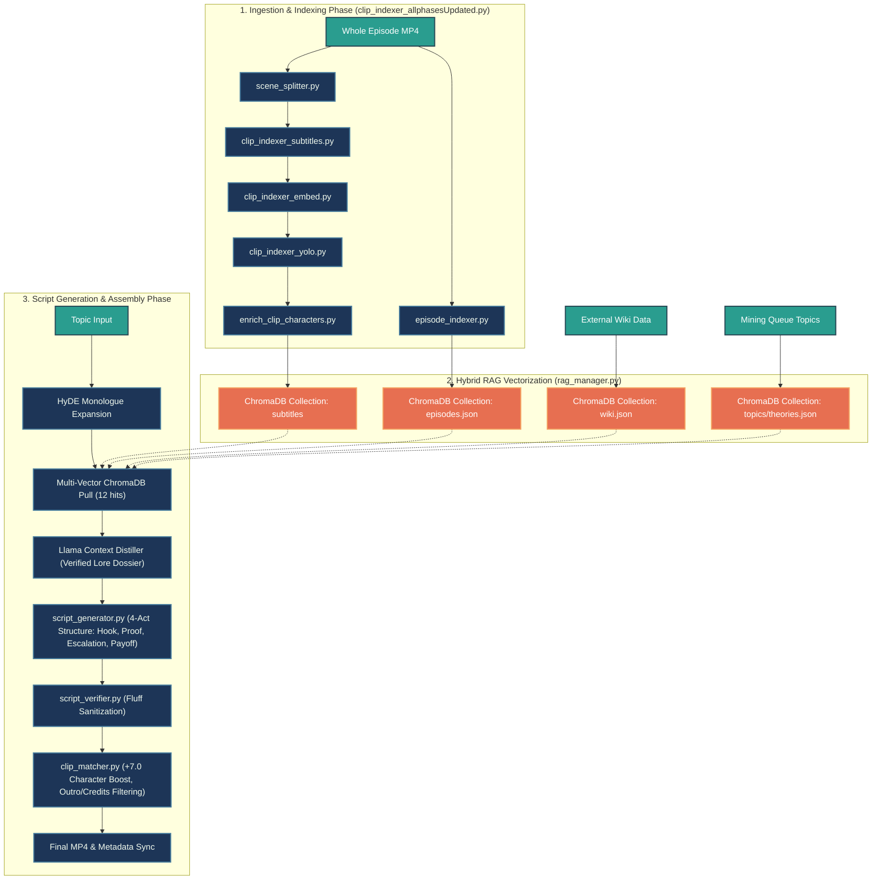

<div align="center">

# 🤖 Autonomous AI Content Automation Pipeline

**An enterprise-grade, 8-phase neural content production engine featuring self-correcting RAG verification, multi-modal computer vision indexing, and fault-tolerant state orchestration.**

[](https://www.python.org/)
[](https://ollama.ai/)
[](https://www.trychroma.com/)
[](https://github.com/ultralytics/ultralytics)
[](https://ffmpeg.org/)
[](https://developers.google.com/youtube/v3)

---

</div>

## 📌 Executive Summary (Recruiter TL;DR)

This repository houses a **compound AI engineering system** designed to solve the reliability, grounding, and workflow bottlenecks of generative video production. While standard AI demos rely on fragile, single-shot `model.generate()` scripts, this engine decouples generation into an **idempotent, 8-phase state machine** capable of taking raw thematic concepts and autonomously deploying fully edited, fact-checked, caption-burned 1080p video assets to YouTube.

### 🌟 Core Engineering Differentiators

| Dimension | Standard AI Demos | This Pipeline |
| :--- | :--- | :--- |
| **Execution Architecture** | Fragile monolithic scripts | **Decoupled 8-Phase State Machine** with JSON persistence |
| **Factuality & Grounding** | Blind generation (High hallucination) | **Closed-loop Verifier LLM** cross-checking RAG vs. live web dossiers |
| **Visual Asset Retrieval** | Basic filename/keyword regex | **Multi-Modal CV Fusion** (Fine-tuned YOLOv8 + LLaVA Vision + NLP Embeddings) |
| **Compute Strategy** | Locked to local hardware or 100% API | **Hybrid Local/Cloud Offloading** (Local pipeline + Colab GPU XTTS synthesis) |
| **Disaster Recovery** | Crashes require complete restart | **Sub-second Resume-on-Interrupt** from exact failure checkpoint |

---

## 🏗️ End-to-End System Architecture & Pipeline Workflow

The newly supercharged AI Explainer content engine decouples production into an idempotent, fault-tolerant workflow spanning media ingestion, vector memory formation, and dynamic video assembly. If interrupted by rate limits, hardware blips, or review gates, execution hydrates cleanly from persistent state ledgers.



The content production lifecycle initiates with the ingestion and indexing phase orchestrated by `clip_indexer_allphasesUpdated.py`, which transforms raw full-length video files into structured, searchable multi-modal assets. When a whole episode MP4 enters the system, it bifurcates into two parallel processing tracks. Along the primary visual and dialogue track, `scene_splitter.py` slices the continuous video into discrete visual scenes based on frame-to-frame histogram shifts. These scenes flow directly into `clip_indexer_subtitles.py` to align dialogue transcripts with exact millisecond timestamps, followed by `clip_indexer_embed.py` which generates dense semantic vector representations of the spoken dialogue. Next, `clip_indexer_yolo.py` deploys custom object detection models across video frames to identify specific character bounding boxes and screen presence. Finally, `enrich_clip_characters.py` fuses these visual detection logs with the dialogue transcripts to output richly annotated clip metadata. Concurrently, the second processing track routes the raw episode MP4 through `episode_indexer.py` to extract macro-level narrative summaries and structural plot progression.

Once the raw media is fully indexed, `rag_manager.py` executes the hybrid retrieval-augmented generation vectorization process to establish long-term system memory. This centralized manager ingests the processed clip dialogue from `subtitles`, the macro narrative summaries from `episodes.json`, canonical background lore from `wiki.json`, and community engagement concepts from `topics/theories.json`. Rather than commingling these distinct data types, `rag_manager.py` partitions them into four dedicated, persistent ChromaDB vector collections. This strict architectural separation guarantees that downstream generation queries can perform targeted multi-vector searches across granular dialogue, episodic context, factual wiki documentation, and viral thematic structures independently without cross-contamination.

The final phase synthesizes these vectorized knowledge bases into highly engaging short-form vertical videos optimized for TikTok and YouTube Shorts. When a conceptual topic input is introduced, the engine applies Hypothetical Document Embeddings via HyDE monologue expansion to generate an idealized narrative response. This expanded query executes a multi-vector ChromaDB pull across all four persistent collections to retrieve the top twelve most semantically relevant context hits. A Llama context distiller condenses these raw retrieval hits into a verified lore dossier, stripping away irrelevant noise while preserving canonical ground truth. Fed by this grounded dossier, `script_generator.py` crafts the narration using a strict four-act dramatic structure consisting of an attention-grabbing hook, empirical proof, narrative escalation, and a satisfying payoff. To maintain viewer retention, `script_verifier.py` subsequently audits the draft to perform fluff sanitization, eliminating repetitive phrasing or pacing drag. Once verified, `clip_matcher.py` pairs each narration segment with optimal video B-roll by applying a positive seven-point scoring boost to clips featuring matching visual characters while strictly filtering out outro sequences and black screen credits. The pipeline culminates in final MP4 video rendering and metadata synchronization, readying the finished short-form asset for immediate publishing.

---

## 🧠 Core Innovation: The Verifier-Corrector Loop

To prevent large language models from fabricating plot points or misattributing canonical lore, **Phase 1b (`script_gen`)** implements an autonomous agentic fact-checking loop before any media rendering begins.


1. **Web Grounding**: A research subagent pulls live discussions, wiki updates, and community consensus into a structured `Research Dossier`.
2. **Canonical Anchoring**: Queries `ChromaDB` vector stores containing 200+ canonical episode transcripts.
3. **Lore Auditing**: An independent Verifier LLM audits every factual claim in the generated script against both the external dossier and local database. Any discrepancy triggers a targeted correction prompt.

---

## 👁️ Multi-Modal Visual Indexing Engine

Matching narration text to video B-roll at scale requires understanding video clips across multiple semantic layers. **Phase 5 (`match`)** utilizes a hybrid retrieval strategy:

* **Object & Character Level (`YOLO_finetuning.py`)**: Custom fine-tuned **YOLOv8** models detect specific character bounding boxes and screen presence across thousands of raw video frames.
* **Semantic & Action Level (`clip_indexer_vision.py`)**: Local Vision-Language Models (**LLaVA** via Ollama) analyze middle-frame extractions to index scene lighting, character actions, and physical environments.
* **Dialogue Level (`episode_indexer.py`)**: Subtitle files are parsed into 384-dimensional sentence embeddings to anchor clips to canonical episode plotlines.

When drafting the assembly manifest, the decision engine calculates a composite similarity score to pair narration chunks with the mathematically optimal clip.

---

## 🛡️ Fault-Tolerant State Machine

Generative video pipelines are inherently volatile: API sockets drop, local GPUs overheat, and user interruptions occur. 

Instead of wrapping code in generic `try/except` blocks, the orchestrator maintains a persistent ledger (`pipeline_state.json`). 

```json
{
  "run_id": "20260626_113000",
  "status": "paused_at_tts",
  "last_completed_phase": "script_gen",
  "phase_outputs": {
    "script_path": "output/why_rick_hates_time_travel/script.txt",
    "topic_folder": "output/why_rick_hates_time_travel"
  }
}
```

* **Zero Work Loss**: Running `python scripts/orchestrator.py --resume` reads the ledger and jumps execution directly to $Phase_{N+1}$.
* **Cloud Offloading**: If local hardware lacks the VRAM for high-end voice synthesis, the state machine cleanly pauses execution, prompts the operator to execute `notebooks/orchestrator_noImage_gpuVoice.ipynb` on cloud GPUs (Google Colab), ingests the resulting `.wav` artifacts, and resumes local assembly.

---

## 📂 Repository Structure

```text
├── 📁 config/                         # YAML configuration definitions (Models, API endpoints, thresholds)
├── 📁 notebooks/                      # GPU Colab notebooks for cloud-offloaded XTTS voice synthesis
├── 📁 prompts/                        # System prompts for Topic Miner, Script Verifier, and RAG agents
├── 📁 scripts/                        # Core modular execution engine
│   ├── orchestrator.py                # Master 8-phase pipeline controller & state ledger manager
│   ├── clip_indexer_allphasesUpdated.py # Master pipeline for video ingestion, splitting, and CV tagging
│   ├── scene_splitter.py              # Visual scene boundary detection via histogram shifts
│   ├── clip_indexer_subtitles.py      # Subtitle alignment and timestamp extraction engine
│   ├── clip_indexer_embed.py          # Dialogue embedding generator for vector retrieval
│   ├── clip_indexer_yolo.py           # Frame-level YOLOv8 object and character detection
│   ├── enrich_clip_characters.py      # Fusion script combining CV character logs with subtitle text
│   ├── episode_indexer.py             # Macro narrative summary and plot progression extractor
│   ├── rag_manager.py                 # Multi-collection ChromaDB ingestion and vectorization manager
│   ├── topic_miner.py                 # Phase 1a: Autonomous topic ideation queue manager
│   ├── script_generator.py            # Phase 1b: 4-Act structure RAG script drafting engine
│   ├── web_researcher.py              # Fact dossier compiler via search APIs
│   ├── script_verifier.py             # Closed-loop fluff sanitization and lore auditor loop
│   ├── tts_local.py                   # Phase 2: Local neural voice synthesis (Piper TTS)
│   ├── captioner.py                   # Phase 3: Faster-Whisper word-level timestamp extraction
│   ├── clip_matcher.py                # Phase 4: Multi-modal visual B-roll matcher (+7.0 char boost)
│   ├── assembler.py                   # Phase 5: Subprocess FFmpeg hardware video compositor
│   ├── thumbnail_generator.py         # Phase 6: Computer vision frame ranker & thumbnail renderer
│   ├── publisher.py                   # Phase 7: YouTube Data API v3 OAuth upload controller
│   ├── YOLO_finetuning.py             # Custom YOLOv8 training pipeline for character detection
│   └── clip_indexer_vision.py         # LLaVA local VLM automated scene tagger
├── 📁 vector_db/                      # Persistent ChromaDB vector collections (4 dedicated spaces)
└── README.md                          # System documentation
```

---

## 🚀 Quickstart Guide

### 1. Environment Installation

```bash
# Clone repository
git clone https://github.com/ankush-10010/AutomationPipeline.git
cd AutomationPipeline

# Install Python dependencies
pip install -r requirements.txt

# Verify local hardware dependencies
ffmpeg -version
ollama list
```

### 2. Pipeline Execution Modes

```bash
# Run complete autonomous production pipeline from a custom concept
python scripts/orchestrator.py --topic "Why Rick's Portal Gun Changes Everything"

# Execute autonomous batch mining & run pipeline on top queued item
python scripts/orchestrator.py --phase topic_mine --count 5
python scripts/orchestrator.py --phase all --auto-approve

# Dry-run system architecture (Calculates manifest & audit trail without rendering)
python scripts/orchestrator.py --topic "Evil Morty's Grand Plan" --dry-run

# Recover from an unexpected hardware shutdown or API rate limit
python scripts/orchestrator.py --resume
```

---

<div align="center">

*Designed & Architected for High-Reliability Generative Media Workflows.*

</div>
