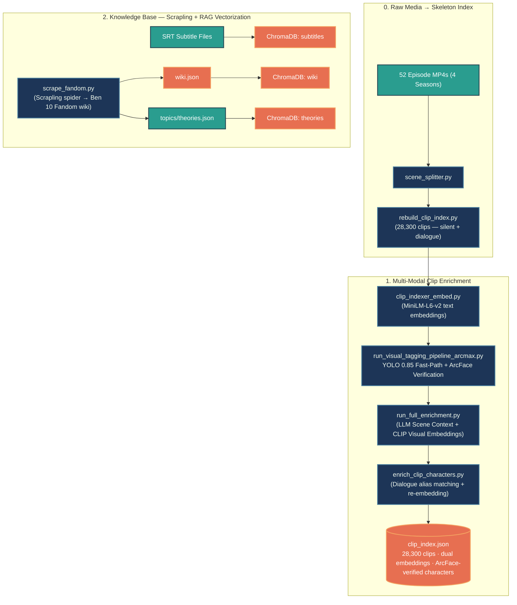
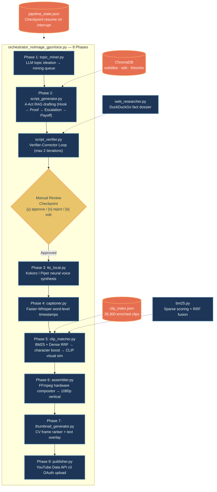

<div align="center">

# 🤖 Autonomous AI Content Automation Pipeline

**8-phase neural content engine: self-correcting RAG, multi-modal CV indexing, BM25+RRF hybrid retrieval, and fault-tolerant state orchestration.**

[](https://www.python.org/)
[](https://ollama.ai/)
[](https://www.trychroma.com/)
[](https://github.com/ultralytics/ultralytics)
[](https://ffmpeg.org/)
[](https://developers.google.com/youtube/v3)

---

</div>

## 📌 What This Is

A compound AI system that takes raw thematic concepts and autonomously produces fact-checked, caption-burned 1080p video assets uploaded to YouTube. Unlike single-shot `model.generate()` demos, this is a **decoupled 8-phase state machine** with checkpoint-based resume, closed-loop fact verification, and hybrid dense+sparse retrieval.

| Dimension | Standard AI Demo | This Pipeline |
| :--- | :--- | :--- |
| **Execution** | Fragile monolithic scripts | **8-Phase State Machine** with JSON persistence |
| **Factuality** | Blind generation | **Verifier-Corrector Loop** cross-checking RAG vs. live web dossiers |
| **Visual Retrieval** | Keyword regex | **BM25 + Dense RRF Fusion** + ArcFace-verified character matching |
| **Character Recognition** | Stock YOLO | **Fine-tuned YOLO + ArcFace metric learning** on CLIP ViT-B-32 |
| **Disaster Recovery** | Full restart | **Sub-second resume** from exact failure checkpoint |

---

## 🏗️ Clip Indexing Architecture

52 episodes → 28,300 clips → enriched `clip_index.json` with dual embeddings and ArcFace-verified characters.



The enrichment pipeline runs globally in four passes: text embeddings (`MiniLM-L6-v2`), ArcMax cascade (YOLO 0.85 fast-path → ArcFace verification for uncertain detections → global frequency pruning), LLM scene context + CLIP ViT-B-32 visual embeddings, and dialogue-based character alias matching with re-embedding. `scrape_fandom.py` crawls the entire Ben 10 Fandom wiki via Scrapling, producing both `wiki.json` (lore) and `theories.json` (fan theories) for ChromaDB ingestion.

---

## 🎬 Content Production Orchestrator

`orchestrator_noImage_gpuVoice.py` wires 8 phases into a fault-tolerant state machine with `pipeline_state.json` for checkpoint resume.



Each phase saves its outputs to `pipeline_state.json`. If the pipeline crashes at any point, `--resume` picks up from `Phase_{N+1}` with zero repeated work. The `--auto-approve` flag skips the manual review checkpoint for fully autonomous runs.

---

## 🧠 Core Innovation: The Verifier-Corrector Loop


Three independent LLMs collaborate: a generator (grounded via ChromaDB RAG), a web researcher (live DuckDuckGo dossier), and a verifier that audits every factual claim against both sources. Hallucinations trigger targeted correction prompts, not full regeneration.

---

## 👁️ Character Recognition: YOLO + ArcFace Cascade

The core hard problem is **character recognition in a cartoon** where the same character (Ben Tennyson) appears in 30+ alien forms, and minor characters might have only 6 training images versus 1,600+ for mains.

**Stage 1 — YOLO Classification (`YOLO_finetuning_noBoundingBox.py`):** We repurposed YOLOv8's classification head (`yolov8n-cls.pt`) at 224×224 on a character image dataset organized into class folders, producing a `best.pt` that classifies frames directly into 30 character/alien classes. No bounding box annotations needed.

**Stage 2 — ArcFace Metric Learning (`arcface_metric_train.py`):** We freeze CLIP ViT-B-32 and train a small projection head (512→256→128) using ArcFace loss. ArcFace optimizes angular separation on the unit hypersphere, so even a class with 6 images gets pushed far from all others. `WeightedRandomSampler` handles imbalance, k-means clustering handles multi-prototype characters. Output: `arcface_head.pt` + `prototypes.npz`.

**ArcMax Cascade at Inference (`run_visual_tagging_pipeline_arcmax.py`):**
- **Fast-Path (YOLO ≥ 0.85):** Character confirmed immediately, no ArcFace math.
- **Slow-Path (YOLO < 0.85):** Crops → frozen CLIP → ArcFace projection → cosine match against prototypes (τ=0.50). 3-frame contiguity filter suppresses noise.
- **Global Pruning:** Characters in <8 clips globally are pruned as false positives.

---

## 🎯 Clip Matching: BM25 + Dense RRF Hybrid Retrieval

`clip_matcher.py` scores 28,300 clips against each narration segment using a three-channel architecture fused via **Reciprocal Rank Fusion** (`bm25.py`):

1. **Sparse Channel (BM25):** `SimpleBM25` computes TF-IDF sparse scores over tokenized clip metadata (dialogue, tags, scene context, visual descriptions).
2. **Dense Channel (MiniLM):** Cosine similarity between the segment's `all-MiniLM-L6-v2` embedding and each clip's pre-computed `embedding`.
3. **RRF Fusion:** `reciprocal_rank_fusion(dense, sparse, k=60)` merges both ranked lists into a single score, eliminating the need to hand-tune sparse vs. dense weights.

On top of the fused RRF base score, `clip_matcher.py` applies intent-classified bonuses: ArcFace-verified character presence (+10–20), alien transformation matches (+15–25 with CLIP visual similarity fallback), CLIP visual-semantic cosine similarity (+12× for >0.20), literal dialogue quote matches (+15×), emotion/tone alignment, and anti-repetition cooldown penalties.

---

## 📂 Repository Structure

```text
├── 📁 config/                              # YAML configuration (models, API endpoints, thresholds, show config)
├── 📁 notebooks/                           # GPU Colab notebooks for cloud-offloaded voice synthesis
├── 📁 prompts/                             # System prompts for Topic Miner, Script Verifier, RAG agents
├── 📁 scripts/                             # Core modular execution engine
│   │
│   │  ── Clip Indexing Pipeline ──
│   ├── scene_splitter.py                   # Visual scene boundary detection via histogram shifts
│   ├── rebuild_clip_index.py               # Skeleton index builder — scans ALL mp4s, including silent clips
│   ├── clip_indexer_embed.py               # MiniLM-L6-v2 text embedding generator
│   ├── run_visual_tagging_pipeline_arcmax.py # ArcMax Cascade: YOLO fast-path + ArcFace verification
│   ├── run_full_enrichment.py              # Orchestrates LLM scene context + CLIP visual embeddings
│   ├── clip_indexer_scene_context.py       # Ollama LLM scene chunker (scene_context, visual_description, emotion_tone)
│   ├── clip_indexer_clip_embed.py          # CLIP ViT-B-32 visual embedding from middle frames
│   ├── clip_indexer_subtitles.py           # Subtitle alignment and timestamp extraction
│   ├── enrich_clip_characters.py           # Dialogue alias matching + semantic re-embedding
│   ├── enrich_clip_metadata.py             # Fast metadata pass: speaker label cleanup, transformation detection
│   │
│   │  ── Model Training ──
│   ├── YOLO_finetuning_noBoundingBox.py    # YOLOv8 classification fine-tuning (no bbox annotations)
│   ├── arcface_metric_train.py             # ArcFace metric learning on frozen CLIP ViT-B-32
│   │
│   │  ── Knowledge Base ──
│   ├── scrape_fandom.py                    # Scrapling spider — crawls entire Ben 10 Fandom wiki
│   ├── rag_manager.py                      # ChromaDB multi-collection ingestion + HyDE retrieval
│   │
│   │  ── Content Production ──
│   ├── orchestrator_noImage_gpuVoice.py    # Master 8-phase controller + fault-tolerant state ledger
│   ├── topic_miner.py                      # LLM topic ideation queue manager
│   ├── script_generator.py                 # 4-Act RAG script drafting engine
│   ├── web_researcher.py                   # Live fact dossier compiler via DuckDuckGo
│   ├── script_verifier.py                  # Verifier-Corrector loop — max 2 correction iterations
│   ├── tts_local.py                        # Local neural voice synthesis (Kokoro / Piper TTS)
│   ├── captioner.py                        # Faster-Whisper word-level timestamp extractor
│   ├── clip_matcher.py                     # BM25+Dense RRF hybrid B-roll matcher + character boost
│   ├── bm25.py                             # BM25 sparse scoring + Reciprocal Rank Fusion
│   ├── assembler.py                        # FFmpeg hardware video compositor
│   ├── thumbnail_generator.py              # CV frame ranker + thumbnail renderer
│   └── publisher.py                        # YouTube Data API v3 OAuth upload controller
├── 📁 vector_db/                           # Persistent ChromaDB vector collections
└── README.md
```

---

## 🚀 Quickstart

```bash
git clone https://github.com/ankush-10010/AutomationPipeline.git && cd AutomationPipeline
pip install -r requirements.txt
```

### Clip Indexing (`clip_indexer_allphasesUpdated.py`)

| Step | Name | Description |
|:---:|:---|:---|
| 1 | `split` | Scene splitter |
| 2 | `subtitle` | SRT dialogue alignment |
| 3 | `embed` | MiniLM-L6-v2 text embeddings |
| 4 | `arcmax` | YOLO + ArcFace cascade |
| 5 | `enrich_full` | LLM scene context + CLIP visual embeddings |
| 6 | `enrich_chars` | Dialogue character matching + re-embedding |

```bash
# Full pipeline
python scripts/clip_indexer_allphasesUpdated.py --episode episodes/s1e1.mp4 --show ben10

# Batch mode
python scripts/clip_indexer_allphasesUpdated.py --batch episodes/ --show ben10

# Resume from step 4
python scripts/clip_indexer_allphasesUpdated.py --episode episodes/s1e1.mp4 --start arcmax

# Cherry-pick specific steps
python scripts/clip_indexer_allphasesUpdated.py --episode episodes/s1e1.mp4 --only arcmax,enrich_chars

# Skip expensive steps
python scripts/clip_indexer_allphasesUpdated.py --episode episodes/s1e1.mp4 --skip enrich_full

# Numeric range
python scripts/clip_indexer_allphasesUpdated.py --episode episodes/s1e1.mp4 --steps 3-6
```

Priority: `--only` > `--steps` > `--start` > `--skip`

### Content Production (`orchestrator_noImage_gpuVoice.py`)

```bash
# Full autonomous pipeline
python scripts/orchestrator_noImage_gpuVoice.py --topic "Why Ben's Omnitrix is the Most Powerful Device"

# Mine topics, then run
python scripts/orchestrator_noImage_gpuVoice.py --phase topic_mine --count 5
python scripts/orchestrator_noImage_gpuVoice.py --phase all --auto-approve

# Resume after crash
python scripts/orchestrator_noImage_gpuVoice.py --resume
```

---

<div align="center">

*Designed & Architected for High-Reliability Generative Media Workflows.*

</div>
