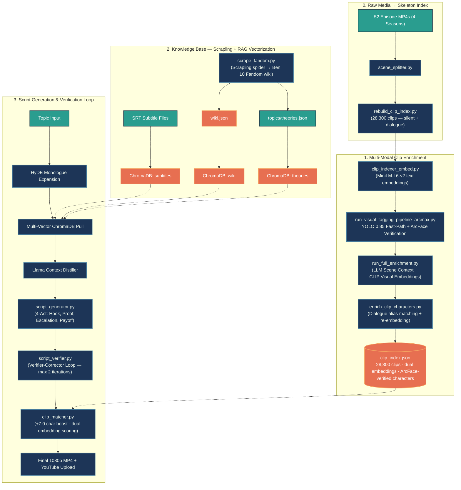
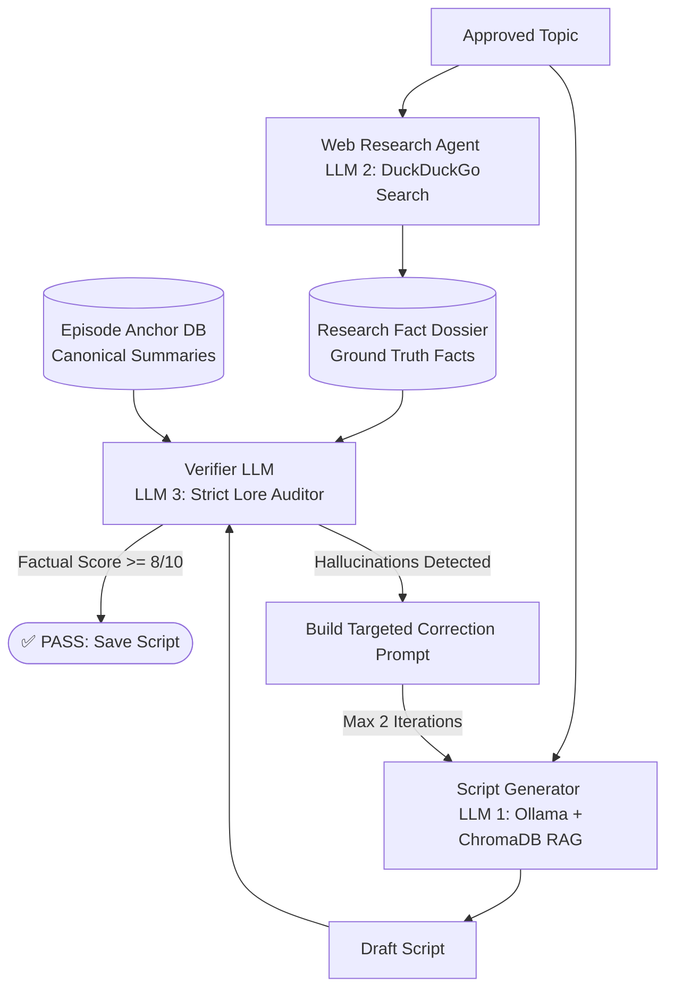

<div align="center">

# 🤖 Autonomous AI Content Automation Pipeline

**An enterprise-grade, 8-phase neural content production engine featuring self-correcting RAG verification, multi-modal computer vision indexing, and fault-tolerant state orchestration.**

[](https://www.python.org/)
[](https://ollama.ai/)
[](https://www.trychroma.com/)
[](https://github.com/ultralytics/ultralytics)
[](https://ffmpeg.org/)
[](https://developers.google.com/youtube/v3)

---

</div>

## 📌 Executive Summary (Recruiter TL;DR)

This repository houses a **compound AI engineering system** designed to solve the reliability, grounding, and workflow bottlenecks of generative video production. While standard AI demos rely on fragile, single-shot `model.generate()` scripts, this engine decouples generation into an **idempotent, 8-phase state machine** capable of taking raw thematic concepts and autonomously deploying fully edited, fact-checked, caption-burned 1080p video assets to YouTube.

### 🌟 Core Engineering Differentiators

| Dimension | Standard AI Demo | This Pipeline |
| :--- | :--- | :--- |
| **Execution Architecture** | Fragile monolithic scripts | **Decoupled 8-Phase State Machine** with JSON persistence |
| **Factuality & Grounding** | Blind generation (High hallucination) | **Closed-loop Verifier LLM** cross-checking RAG vs. live web dossiers |
| **Visual Asset Retrieval** | Basic filename/keyword regex | **Multi-Modal CV Fusion** (Fine-tuned YOLOv8 + LLaVA Vision + NLP Embeddings) |
| **Compute Strategy** | Locked to local hardware or 100% API | **Hybrid Local/Cloud Offloading** (Local pipeline + Colab GPU XTTS synthesis) |
| **Disaster Recovery** | Crashes require complete restart | **Sub-second Resume-on-Interrupt** from exact failure checkpoint |

---

## 🏗️ End-to-End System Architecture & Pipeline Workflow

The pipeline operates in two major macro-phases: **Clip Indexing** (a one-time offline preprocessing run over all 4 seasons / ~28,300 clips) and **Content Production** (the live, per-topic generation loop). Both phases are fault-tolerant and resumable from checkpoint state.



The content production lifecycle begins with a one-time offline indexing run across all 52 Ben 10 episodes spanning 4 seasons. `scene_splitter.py` applies frame-to-frame histogram shift detection to slice every episode into discrete visual scenes, producing approximately 28,300 clips. Unlike naive pipelines that skip silent action clips, `rebuild_clip_index.py` scans every MP4 on disk and builds a complete skeleton index entry for all of them — including clips with no dialogue — to prevent coverage gaps during clip matching.

With the skeleton index in place, the enrichment pipeline runs globally across all 28,300 clips in four passes. `clip_indexer_embed.py` first computes `all-MiniLM-L6-v2` text embeddings from dialogue and keyword tags. The ArcMax cascade pipeline (`run_visual_tagging_pipeline_arcmax.py`) then runs the fine-tuned YOLO classifier at a confidence threshold of 0.85: clips where YOLO is highly certain bypass the expensive ArcFace math entirely via a fast-path, while uncertain detections get their YOLO bounding box crops extracted and verified by the fine-tuned CLIP + ArcFace projection head against prototype embeddings. Any character appearing in fewer than 8 clips globally is pruned as a false positive, yielding `visual_characters` and `prototype_detections` fields with high-confidence character presence signals. `run_full_enrichment.py` then runs an Ollama LLM pass to generate clip-level `scene_context`, `visual_description`, and `emotion_tone` metadata, followed by a CLIP ViT-B-32 visual embedding pass over middle frames to produce `clip_visual_embedding`. Finally, `enrich_clip_characters.py` regex-matches character aliases from `show_config.yaml` against subtitle dialogue to augment visual detections with text-confirmed character tags and re-embeds all clips with the full enriched metadata context.

The knowledge base is assembled in parallel. `scrape_fandom.py` uses Scrapling's async spider to crawl the entire Ben 10 Fandom wiki, converting character lore, alien biology, and episode trivia into `wiki.json`. `rag_manager.py` ingests this alongside episode transcripts, plot summaries, and fan theories into four dedicated ChromaDB vector collections. This partitioned architecture ensures that downstream retrieval queries can pull precisely from dialogue, episodic context, canonical lore, or viral theory content independently.

The live generation loop takes a topic concept and applies Hypothetical Document Embeddings (HyDE) to generate an idealized narrative response, which is then used as an enriched query vector against all four ChromaDB collections. A Llama context distiller condenses the top retrieval hits into a verified canonical dossier. `script_generator.py` uses this grounded dossier to craft a narration following a strict four-act dramatic structure: hook, empirical proof, narrative escalation, and satisfying payoff. The Verifier-Corrector Loop then audits every factual claim before any media rendering begins. Once verified, `clip_matcher.py` pairs narration segments with optimal B-roll using a composite scoring function that weighs text-semantic similarity, CLIP visual-semantic similarity, character presence boosts, transformation matches, and scene context alignment, while filtering outro sequences and black-screen credits.

---

## 🧠 Core Innovation: The Verifier-Corrector Loop

To prevent large language models from fabricating plot points or misattributing canonical lore, **Phase 1b (`script_gen`)** implements an autonomous agentic fact-checking loop before any media rendering begins.



1. **Web Grounding**: A research subagent pulls live discussions, wiki updates, and community consensus into a structured `Research Dossier`.
2. **Canonical Anchoring**: Queries `ChromaDB` vector stores containing 200+ canonical episode transcripts.
3. **Lore Auditing**: An independent Verifier LLM audits every factual claim in the generated script against both the external dossier and local database. Any discrepancy triggers a targeted correction prompt.

---

## 👁️ Multi-Modal Visual Indexing Engine

The core hard problem with this project is **character recognition in a cartoon** where the same character (Ben Tennyson) can appear in 30+ completely different alien forms, and minor characters like Eye Guy might have only 6 training images while main characters have 1,600+. A standard softmax classifier would simply ignore rare classes. We solved this with a three-layer approach.

### Problem 1: Characters Were Not Being Identified

The initial pipeline using stock YOLOv8 was unable to reliably identify Ben 10 specific characters and alien forms because the base model had never seen cartoon animation frames at this specificity. We solved this with two targeted fine-tuning stages.

**Stage 1 — YOLO Classification Fine-Tuning (`YOLO_finetuning_noBoundingBox.py`):** Rather than training a detection model that requires bounding box annotations (which are expensive to produce), we repurposed YOLOv8's image classification head (`yolov8n-cls.pt`). The model is trained at 224×224 resolution on a character image dataset organized into class folders, producing a `best.pt` that can classify a whole frame or crop into one of the 30 Ben 10 character/alien classes directly. This sidesteps the annotation bottleneck entirely.

**Stage 2 — ArcFace Metric Learning on Fine-Tuned CLIP (`arcface_metric_train.py`):** The second stage addresses the class-imbalance problem that defeats standard softmax. We freeze the CLIP ViT-B-32 backbone and train only a small projection head (512 → 256 → 128 dimensions, `ProjectionHead`) on top using ArcFace loss. ArcFace optimizes for angular separation on the unit hypersphere: even a class with 6 training images gets pushed far away from all other classes in embedding space because the loss penalizes the angle between an embedding and its class center, not class frequency. The dataset is balanced using `WeightedRandomSampler` so rare characters are oversampled. For high-image-count classes like Ben, k-means clustering produces multiple sub-prototypes to handle outfit/transformation variance. The output is `arcface_head.pt` (projection weights) and `prototypes.npz` (per-class prototype embeddings in the 128-d space).

### The ArcMax Cascade (`run_visual_tagging_pipeline_arcmax.py`)

At inference time, the two stages combine into a two-speed cascade to handle 28,300 clips efficiently:

* **Fast-Path (YOLO ≥ 0.85 confidence):** When the fine-tuned YOLO classifier is highly certain, the character is confirmed immediately. No ArcFace math runs. This handles the majority of clips where main characters appear prominently.
* **Slow-Path (YOLO < 0.85):** Uncertain detections have their YOLO bounding box crops extracted, passed through frozen CLIP ViT-B-32, projected through the ArcFace head, and matched against stored prototypes using cosine similarity with threshold τ = 0.50. A contiguity filter requires a character to appear in at least 3 consecutive frames before being tagged, suppressing single-frame noise.
* **Global Frequency Pruning:** After processing all clips, any character detected in fewer than 8 clips total is pruned as a false positive — an especially useful guard against background extras being mistaken for named characters.

### Dual Embedding Strategy

Each clip in the final index carries two orthogonal embedding spaces used jointly by `clip_matcher.py`:

* **`embedding`** — `all-MiniLM-L6-v2` text embedding over the enriched metadata string (characters, emotion tone, LLM scene context, dialogue, tags). This captures *semantic narrative meaning*.
* **`clip_visual_embedding`** — CLIP ViT-B-32 embedding of the middle frame of the actual video clip. This captures *visual content* directly and is the primary signal for matching narration about specific visual events (e.g. "Ben transforms into Heatblast") to clips showing exactly that.

### Data — Scrapling for the Knowledge Base

Character lore, alien biology, episode trivia, and fan theories were collected by running `scrape_fandom.py`, which uses Scrapling's async spider framework to crawl the entire Ben 10 Fandom wiki. The scraped content is stored in `wiki.json` and ingested into a dedicated ChromaDB vector collection, giving the RAG system access to canonical show knowledge that no language model reliably has in its weights.

---

## 🛡️ Fault-Tolerant State Machine

Generative video pipelines are inherently volatile: API sockets drop, local GPUs overheat, and user interruptions occur. 

Instead of wrapping code in generic `try/except` blocks, the orchestrator maintains a persistent ledger (`pipeline_state.json`). 

```json
{
  "run_id": "20260626_113000",
  "status": "paused_at_tts",
  "last_completed_phase": "script_gen",
  "phase_outputs": {
    "script_path": "output/why_rick_hates_time_travel/script.txt",
    "topic_folder": "output/why_rick_hates_time_travel"
  }
}
```

* **Zero Work Loss**: Running `python scripts/orchestrator.py --resume` reads the ledger and jumps execution directly to $Phase_{N+1}$.
* **Cloud Offloading**: If local hardware lacks the VRAM for high-end voice synthesis, the state machine cleanly pauses execution, prompts the operator to execute `notebooks/orchestrator_noImage_gpuVoice.ipynb` on cloud GPUs (Google Colab), ingests the resulting `.wav` artifacts, and resumes local assembly.

---

## 📂 Repository Structure

```text
├── 📁 config/                              # YAML configuration (models, API endpoints, thresholds, show config)
├── 📁 notebooks/                           # GPU Colab notebooks for cloud-offloaded voice synthesis
├── 📁 prompts/                             # System prompts for Topic Miner, Script Verifier, RAG agents
├── 📁 scripts/                             # Core modular execution engine
│   │
│   │  ── Clip Indexing Pipeline ──
│   ├── scene_splitter.py                   # Visual scene boundary detection via histogram shifts
│   ├── rebuild_clip_index.py               # Skeleton index builder — scans ALL mp4s, including silent clips
│   ├── clip_indexer_embed.py               # MiniLM-L6-v2 text embedding generator
│   ├── run_visual_tagging_pipeline_arcmax.py # ArcMax Cascade: YOLO fast-path + ArcFace verification
│   ├── run_full_enrichment.py              # Orchestrates LLM scene context + CLIP visual embeddings
│   ├── clip_indexer_scene_context.py       # Ollama LLM scene chunker (scene_context, visual_description, emotion_tone)
│   ├── clip_indexer_clip_embed.py          # CLIP ViT-B-32 visual embedding from middle frames
│   ├── clip_indexer_subtitles.py           # Subtitle alignment and timestamp extraction
│   ├── enrich_clip_characters.py           # Dialogue alias matching + semantic re-embedding
│   ├── enrich_clip_metadata.py             # Fast metadata pass: speaker label cleanup, transformation detection
│   ├── episode_indexer.py                  # Macro episode plot summary and structure extractor
│   │
│   │  ── Model Training ──
│   ├── YOLO_finetuning_noBoundingBox.py    # YOLOv8 classification fine-tuning (no bounding box annotations needed)
│   ├── arcface_metric_train.py             # ArcFace metric learning on frozen CLIP ViT-B-32 (Colab)
│   │
│   │  ── Knowledge Base ──
│   ├── scrape_fandom.py                    # Scrapling async spider — crawls entire Ben 10 Fandom wiki
│   ├── rag_manager.py                      # ChromaDB multi-collection ingestion and HyDE retrieval engine
│   │
│   │  ── Content Production Orchestrator ──
│   ├── orchestrator_noImage_gpuVoice.py    # Master 8-phase pipeline controller & fault-tolerant state ledger
│   ├── topic_miner.py                      # Autonomous topic ideation queue manager
│   ├── script_generator.py                 # 4-Act RAG script drafting engine
│   ├── web_researcher.py                   # Live fact dossier compiler via DuckDuckGo search
│   ├── script_verifier.py                  # Verifier-Corrector closed loop — max 2 correction iterations
│   ├── tts_local.py                        # Local neural voice synthesis (Kokoro / Piper TTS)
│   ├── captioner.py                        # Faster-Whisper word-level timestamp extractor
│   ├── clip_matcher.py                     # Multi-modal B-roll matcher (text + visual embeddings + char boost)
│   ├── assembler.py                        # FFmpeg hardware video compositor
│   ├── thumbnail_generator.py              # CV frame ranker & thumbnail renderer
│   └── publisher.py                        # YouTube Data API v3 OAuth upload controller
├── 📁 vector_db/                           # Persistent ChromaDB vector collections (4 dedicated spaces)
└── README.md
```

---

## 🚀 Quickstart Guide

### 1. Environment Installation

```bash
# Clone repository
git clone https://github.com/ankush-10010/AutomationPipeline.git
cd AutomationPipeline

# Install Python dependencies
pip install -r requirements.txt

# Verify local hardware dependencies
ffmpeg -version
ollama list
```

### 2. Pipeline Execution Modes

```bash
# Run complete autonomous production pipeline from a custom concept
python scripts/orchestrator.py --topic "Why Rick's Portal Gun Changes Everything"

# Execute autonomous batch mining & run pipeline on top queued item
python scripts/orchestrator.py --phase topic_mine --count 5
python scripts/orchestrator.py --phase all --auto-approve

# Dry-run system architecture (Calculates manifest & audit trail without rendering)
python scripts/orchestrator.py --topic "Evil Morty's Grand Plan" --dry-run

# Recover from an unexpected hardware shutdown or API rate limit
python scripts/orchestrator.py --resume
```

---

<div align="center">

*Designed & Architected for High-Reliability Generative Media Workflows.*

</div>
