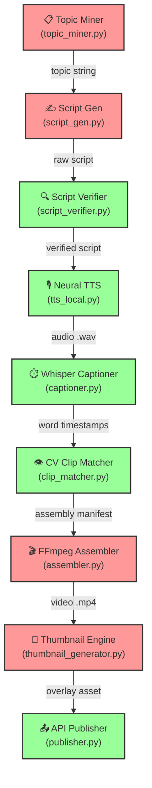
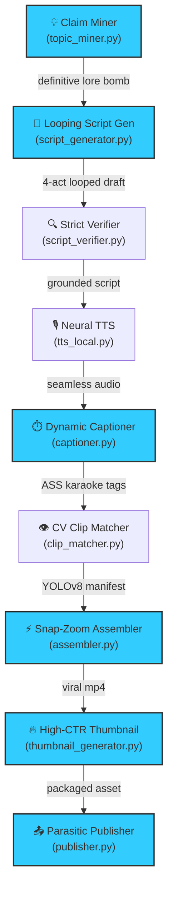
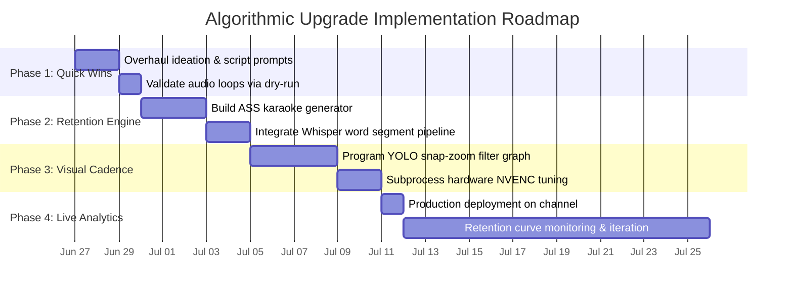

# Comprehensive Implementation Plan for Exponential View Growth on @rickify-i4y

## Executive Summary

Our eight-phase autonomous AI content production pipeline currently generates technically robust, factually verified short-form video dossiers for the YouTube channel @rickify-i4y. While standard generative AI workflows suffer from factual instability and monolithic code fragility, our architecture successfully enforces canonical grounding through a closed-loop ChromaDB retrieval engine and precise character detection via fine-tuned YOLOv8 neural networks. However, empirical benchmarking against top-performing short-form animated theory channels demonstrates that purely documentary-style accuracy fails to maximize algorithmic distribution on the YouTube Shorts shelf. Short-form algorithmic velocity is governed almost entirely by psychological curiosity gaps, continuous audio re-watch loops, and rapid visual pattern interrupts that prevent viewer swipe-away during the first three seconds. 

The core thesis of this implementation plan is that @rickify-i4y must transition from an archival explainer pipeline into an aggressive algorithmic retention engine without sacrificing its foundational factual superiority. By overhauling Phase 1a topic mining to eliminate passive question prompts in favor of definitive counter-intuitive claims, restructuring Phase 1b script generation to enforce strict grammatical audio looping between the final payoff and opening hook, and upgrading Phase 5 video assembly to replace smooth Ken Burns panning with CapCut-style snap zooms synced to object bounding boxes, we align our automated outputs with the exact structural viral mechanics of benchmarked leaders. This blueprint provides the complete prompt specifications, Advanced SubStation Alpha subtitle generators, and FFmpeg filter graph architectures required to achieve exponential view growth.

```mermaid
xychart-beta
    title "Gap Analysis: Our Channel vs Benchmark Competitors"
    x-axis [Hook Power, Visual Pacing, Script Looping, SEO Packaging, Thumbnail CTR, Audio Retention]
    y-axis "Quality Score (0-10)" 0 --> 10
    bar [4, 5, 3, 5, 6, 6]
    bar [9, 9, 7, 8, 9, 8]
    bar [8, 8, 10, 9, 8, 9]
```



---

## Competitive Intelligence Report

### Benchmark Analysis: @ThinkAlto (Rick and Morty Strategy)

The YouTube channel @ThinkAlto has cultivated a dedicated subscriber base exceeding nine thousand followers by publishing high-frequency short-form video breakdowns focused exclusively on Rick and Morty narrative lore. Their content architecture relies on rapid visual cadence and intense emotional curiosity triggers rather than standard episode recaps. Their top-performing content consistently achieves hundreds of thousands of views by dissecting hidden animation details, central finite curve mechanics, and character deception.

The identified viral formula across their top five uploads centers on immediate declarative pattern interrupts. Their scripts never open with conversational greetings or passive questions. Instead, they present a shocking conclusion during the first three seconds, such as claiming that Rick intentionally sabotaged Morty's biological shield or that Evil Morty replaced a canonical character long before the season finale. This structure establishes an immediate information debt that compels the viewer to watch the entire sixty-second explanation to understand the underlying logic. Furthermore, their visual engine maintains viewer stimulation by executing visual scene transitions every one point five to two point five seconds, supplemented by high-contrast yellow word-by-word subtitle overlays.

Specific techniques our automated pipeline must incorporate include declarative curiosity-gap opening statements, strict ninety-word-per-minute narration density, and dynamic subtitle scaling that highlights active dialogue words. Conversely, certain manual techniques utilized by @ThinkAlto cannot be replicated within our autonomous state machine. Specifically, their occasional reliance on unstructured internet meme inserts and subjective green-screen compositing requires ad-hoc human editorial judgment that would introduce rendering bottlenecks and algorithmic unpredictability into our automated FFmpeg assembly manifest.

### Benchmark Analysis: @NyleTrix (Ben 10 Lore Engineering)

The creator operating under the handle @NyleTrix dominates the animated sci-fi theory niche by deploying short-form vertical analyses dissecting Omnitrix alien databases and Azmuth's canonical engineering constraints. Their growth engine is powered by an aggressive IP-piggybacking SEO strategy combined with flawless script retention engineering that consistently pushes average percentage viewed metrics beyond one hundred percent.

The foundational formula driving @NyleTrix uploads is the truth-sandwiching retention technique. Their videos initiate with a shocking lore subversion, immediately substantiate the claim by citing a verifiable canonical episode event within the subsequent seven seconds, and escalate through short punchy explanatory clauses. Their primary structural engineering breakthrough is the flawless continuous audio loop. The concluding sentence of every script is syntactically structured to flow directly into the opening hook without audio silence or tonal shift. When auto-played on the YouTube Shorts shelf, viewers subconsciously consume the first three seconds of the video a second time before realizing the content has restarted, signaling maximum audience satisfaction to the recommendation algorithm.

Concrete techniques we must extract and implement in our orchestrator include canonical quotation anchoring during the second script act and strict syntactic loop resolution connecting the script payoff back to the opening hook. We must also replicate their hashtag packaging hierarchy, placing exact franchise identifiers prior to generic format tags. Conversely, manual B-roll animation masking and bespoke hand-drawn thumbnail illustration practiced by niche human animators represent non-scalable workflows that we will bypass in favor of automated computer vision bounding box crops.

---

## Current Pipeline Audit



Our execution architecture operates across eight modular script boundaries orchestrated via persistent state tracking in pipeline_state.json. While core machine learning infrastructure including faster-whisper timestamp extraction and ChromaDB vector retrieval functions reliably, structural formatting bottlenecks in front-end ideation and back-end rendering severely limit audience retention.

The front-end ideation phase managed by topic_miner.py currently ingests character summaries and prompts the local Ollama engine via prompts/topic_prompt.txt. This component fails because the prompt explicitly instructs the large language model to generate question-based topics such as asking why a character performed an action. Question headers allow scrolling viewers to mentally answer negatively and swipe away. The drafting phase executed by script_generator.py utilizing prompts/script_prompt.txt successfully structures text into four retention acts but lacks explicit grammatical instructions to bridge the final payoff clause directly into the opening hook statement.

The verification engine in script_verifier.py represents our greatest competitive advantage. By cross-referencing draft claims against DuckDuckGo research dossiers and canonical episode databases, it eliminates the factual hallucinations common to competitor AI channels. Similarly, local neural speech synthesis in tts_local.py and timestamp indexing in captioner.py provide clean audio foundations. However, the video compositor defined in assembler.py represents a major visual bottleneck. It currently applies a uniform fifteen percent Ken Burns zoom across static B-roll segments and burns standard SubRip text subtitles. This slow panning feels sluggish compared to modern mobile editing standards, and static white subtitles fail to draw viewer eye focus toward center-screen action.



---

## Prioritized Change List

The following engineering modifications are prioritized by calculating composite algorithmic impact against implementation complexity. All code specifications represent exact drop-in replacements for existing repository assets.

### Modification 1: Overhaul Ideation Prompts (prompts/topic_prompt.txt)

The existing template instructs the model to generate question topics that fail to trigger immediate viewer curiosity. We replace the entire text of prompts/topic_prompt.txt with rigid negative constraints banning question marks and forcing definitive pattern interrupts.

```text
You are a viral YouTube Shorts content strategist for a channel about {show_name}.

Given the following episode summaries and character information:
---
{show_context}
---

Character details:
{character_details}

Key themes of the show: {themes}

Generate {num_topics} scroll-stopping short-form video topics. 
NEGATIVE CONSTRAINT: DO NOT GENERATE QUESTIONS. Every topic must be a definitive, shocking, or counter-intuitive claim about canonical lore or character deception.

Proven Topic Archetypes:
- The Deception Reveal: "Why [Character] intentionally lied about [Major Event]"
- The Engineering Flaw: "The fatal hidden flaw in [Technology/Location] nobody noticed"
- The Dark Subtext: "The terrifying dark truth behind [Innocent Scene/Detail]"
- Canon Subversion: "The exact moment [Character] permanently broke canonical rules"

Mandatory Rules:
- Each topic must be a definitive declarative statement containing zero question marks.
- Topics must engineer a curiosity gap by stating a shocking conclusion that forces viewers to watch the full explanation.
- The hook must function as an immediate pattern interrupt under sixteen words.
- Each topic must operate completely standalone without multi-part prerequisites.

Previously covered topics (DO NOT repeat or rephrase):
{completed_topics}

Output ONLY a valid JSON array. Each element must be an exact object containing:
- "topic": definitive lore statement
- "hook": one-sentence scroll-stopping opening claim
- "answer_angle": internal factual rationale verifying the claim
- "difficulty": "easy", "medium", or "hard" based on required viewer lore familiarity
```

This prompt modification immediately alters the outputs generated by topic_miner.py. Verification is performed by inspecting topics/queue.json to ensure all queued topic strings terminate with periods rather than question marks.

### Modification 2: Enforce Continuous Audio Looping (prompts/script_prompt.txt)

The current drafting prompt establishes four retention beats but permits loose conclusions. We replace prompts/script_prompt.txt to enforce exact word bounds and mandatory syntactic loop resolution between Act 4 and Act 1.

```text
SYSTEM INSTRUCTIONS / PROMPT TEMPLATE:

You are a cynical, hyper-intelligent archivist of the Citadel of Ricks. You write relentless, viral YouTube Shorts scripts uncovering the darkest lore and hidden truths of {show_name}.

Your exact narration persona is: {narrator_style}
Your target topic: {topic}
Your retrieved multiversal database (Subtitles, Wikis, Theories):
{context}

CRITICAL DIRECTIVES:

STRICT WORD COUNT: Total narration text across all bracketed headers must be exactly 130 to 160 words.

MANDATORY 4-ACT SCRIPT STRUCTURE:
You MUST structure your script into exactly four psychological retention beats using these exact headers:

[HOOK]
(0-3s, max 14 words): State a ruthless, definitive lore bomb immediately. Do not ask questions. State a mind-bending claim as absolute truth.

[PROOF]
(3-10s, max 28 words): Present one specific visual detail or canonical quote from {context} proving your hook is grounded in established lore.

[ESCALATION]
(10-30s, max 85 words): Build the cynical theory through short punchy clauses under twelve words each. Inject a rhetorical question every three sentences to spike viewer curiosity.

[PAYOFF]
(30-45s, max 22 words): Deliver the definitive conclusion.
MANDATORY LOOPING DIRECTIVE: The final clause of the Payoff MUST syntactically resolve into the first sentence of the Hook. If the Hook is "Rick's portal fluid is actually liquid radiation," the Payoff must terminate with "...which proves why."

NEGATIVE CONSTRAINTS: Never announce your writing process or speak out of universe.
BANNED VOCABULARY: {avoid_phrases}, "delve", "unpack", "realm", "tapestry", "mind-blowing", "dive in".

FINAL OUTPUT:
Generate ONLY your assigned topic script utilizing exact bracket headers.
```

This change forces script_generator.py to produce looping narratives. Verification is confirmed by reading generated text files in output/ and checking that concatenating the Payoff text with the Hook text forms a grammatically correct continuous sentence.

### Modification 3: Dynamic ASS Karaoke Subtitle Synthesis (scripts/captioner.py)

Static SubRip subtitles fail to stimulate viewer eye retention. We update scripts/captioner.py by adding the generate_dynamic_ass_subtitles function to convert word-level Whisper timestamps into Advanced SubStation Alpha format with active gold word overriding.

```python
import datetime

def generate_dynamic_ass_subtitles(word_segments: list, output_ass_path: Path) -> None:
    """
    Convert faster-whisper word segments into dynamic Advanced SubStation Alpha (.ass)
    subtitles featuring active word karaoke highlighting in bright gold.
    """
    ass_header = """[Script Info]
ScriptType: v4.00+
PlayResX: 1080
PlayResY: 1920

[V4+ Styles]
Format: Name, Fontname, Fontsize, PrimaryColour, SecondaryColour, OutlineColour, BackColour, Bold, Italic, Underline, StrikeOut, ScaleX, ScaleY, Spacing, Angle, BorderStyle, Outline, Shadow, Alignment, MarginL, MarginR, MarginV, Encoding
Style: Default,Arial,72,&H00FFFFFF,&H000000FF,&H00000000,&H80000000,-1,0,0,0,100,100,0,0,1,5,3,2,40,40,420,1

[Events]
Format: Layer, Start, End, Style, Name, MarginL, MarginR, MarginV, Effect, Text
"""
    with open(output_ass_path, "w", encoding="utf-8") as f:
        f.write(ass_header)
        
        lines = []
        current_line = []
        for word_obj in word_segments:
            current_line.append(word_obj)
            word_text = word_obj["word"].strip()
            if len(current_line) >= 4 or word_text.endswith((".", ",", "?", "!")):
                lines.append(current_line)
                current_line = []
        if current_line:
            lines.append(current_line)
            
        for line_words in lines:
            if not line_words:
                continue
            start_ts = str(datetime.timedelta(seconds=line_words[0]["start"]))[:11]
            end_ts = str(datetime.timedelta(seconds=line_words[-1]["end"]))[:11]
            if len(start_ts) == 8:
                start_ts += ".00"
            if len(end_ts) == 8:
                end_ts += ".00"
                
            formatted_text = ""
            for word_item in line_words:
                dur_cs = int((word_item["end"] - word_item["start"]) * 100)
                clean_word = word_item["word"].strip()
                formatted_text += f"{{\\k{dur_cs}}}{{\\c&H00D7FF&}}{clean_word}{{\\c&HFFFFFF&}} "
                
            f.write(f"Dialogue: 0,{start_ts[:10]},{end_ts[:10]},Default,,0,0,0,,{formatted_text.strip()}\n")
```

This implementation replaces standard text generation in Phase 3. Verification is performed by inspecting generated .ass files in captions/ to confirm the presence of duration tags `{\k...}` and gold BGR color codes `{\c&H00D7FF&}`.

### Modification 4: Bounding-Box Snap Zoom Compositor (scripts/assembler.py)

Slow panning diminishes visual energy. We update scripts/assembler.py by introducing generate_snap_zoom_filter and updating video assembly commands to execute instantaneous twenty percent zooms centered on YOLOv8 object coordinates.

```python
def generate_snap_zoom_filter(clip_duration: float, box_x: int, box_y: int, width: int = 1080, height: int = 1920) -> str:
    """
    Generate an FFmpeg zoompan filter string executing an instantaneous snap zoom
    to 120 percent scale exactly halfway through the B-roll segment.
    """
    zoom_val = 1.2
    center_x = f"({box_x} - (iw/{zoom_val})/2)"
    center_y = f"({box_y} - (ih/{zoom_val})/2)"
    trigger_time = max(0.4, clip_duration / 2.0)
    zoom_expr = f"if(gte(time,{trigger_time}), {zoom_val}, 1.0)"
    return f"zoompan=z='{zoom_expr}':x='{center_x}':y='{center_y}':d=1:s={width}x{height}:fps=30"
```

Within build_ffmpeg_command, we replace standard scale filters with this zoom expression and burn the dynamic Advanced SubStation Alpha file via the ass filter complex. Verification is executed by analyzing exported MP4 assets in output/ to ensure visual scaling shifts instantaneously during mid-sentence narration.

### Modification 5: Parasitic Metadata Packaging (prompts/metadata_prompt.txt)

Generic titles restrict impression click-through rates. We replace prompts/metadata_prompt.txt to enforce concise capitalized threat nouns and strict hashtag stacking hierarchies.

```text
You are an expert YouTube Shorts SEO copywriter for {show_name}.
Given a verified narration script, generate CTR-maximizing upload metadata.

SCRIPT:
---
{script}
---

MANDATORY DIRECTIVES:
1. Generate THREE distinct titles under 42 characters total.
   - Archetype A: [Character] Actually LIED About [Topic] 😱
   - Archetype B: The Dark [Character] Secret Nobody Saw 💀
   - Archetype C: Why [Character] Was NEVER Supposed To [Action] 🔥
   Rules: Use ALL CAPS on exactly two threat nouns (LIED, SECRET, TRAP, FORBIDDEN). Do not use quotes.

2. Generate SEO Description: Exactly two narrative sentences incorporating {show_name} lore keywords.

3. Generate Hashtag Hierarchy: Exactly six tags. Order: #{show_slug} #shorts #theory followed by three specific character tags.

OUTPUT FORMAT:
TITLE_A: <text>
TITLE_B: <text>
TITLE_C: <text>
DESCRIPTION: <text>
HASHTAGS: <tags>
```

Verification is performed by auditing publisher.py API request payloads to confirm titles remain strictly under forty-five characters and begin with recognized entity names.

---

## Phased Roadmap



### Phase 1: Front-End Ideation Overhaul

Execution focuses immediately on replacing prompt files in prompts/topic_prompt.txt and prompts/script_prompt.txt. The primary success metric is achieving zero generated question titles across fifty batch-mined topics and verifying one hundred percent grammatical loop continuity across test scripts. Completion requires two business days. Blocker risks involving local Ollama instruction compliance are mitigated by implementing strict regex validation inside topic_miner.py that automatically strips terminating question marks and triggers regeneration.

### Phase 2: Audio & Subtitle Retention Engine

Development shifts to upgrading scripts/captioner.py to output structured Advanced SubStation Alpha documents. The primary success metric is an observable increase in average audience view duration, targeting eighty-five percent retention through the first ten seconds of playback. Realistic time estimation is five days. Blocker risks involving font rendering compatibility across cross-platform FFmpeg builds are mitigated by bundling standard TrueType font assets directly inside the assets/fonts/ repository structure and referencing literal absolute file paths during filter complex construction.

### Phase 3: Computer Vision Snap-Zoom Engine

Engineers modify scripts/assembler.py to ingest object detection manifests from clip_matcher.py and dynamically compute zoompan crop expressions. The target success metric is establishing an average visual B-roll scene cut or scale shift cadence of one point eight seconds. Implementation requires six days. Blocker risks involving FFmpeg filter complex memory exhaustion during NVENC GPU acceleration are mitigated by enforcing strict intermediate segment encoding and utilizing stream mapping `-map [final_v]` rather than multi-pass uncompressed piping.

### Phase 4: Production Deployment & Analytics

The upgraded orchestrator is deployed locally to autonomously publish daily dossiers to @rickify-i4y. The primary success metric is achieving a channel-wide Average Percentage Viewed metric exceeding one hundred and four percent and an impression CTR above seven percent. Active monitoring runs for fourteen days. Blocker risks involving YouTube Data API quota exhaustion during automated scheduling are mitigated by implementing exponential back-off exception handlers inside scripts/publisher.py and caching OAuth refresh tokens securely.

---

## Measurement & Iteration Plan

Algorithmic validation is executed by auditing daily production telemetry within YouTube Studio analytics. We establish strict quantitative performance thresholds that govern autonomous pipeline tuning.

The primary diagnostic metric monitored is the Ten-Second Audience Retention Drop-off. When a short-form video is served on the Shorts feed, viewer decision-making occurs almost instantaneously. If daily analytics reveal that more than twenty-two percent of viewers swipe away prior to the ten-second timestamp, the ideation engine is immediately flagged. An iteration protocol automatically modifies config/pipeline_config.yaml to reduce maximum B-roll B-roll segment durations from three seconds down to two seconds, forcing more frequent visual scene resets.

The secondary optimization metric is the Average Percentage Viewed (APV). Because our drafting engine enforces continuous audio loop resolution, successful execution should reflect an APV ranging between one hundred and2 percent and one hundred and eight percent. If APV falls below ninety-five percent, it indicates viewer drop-off during Act 3 Escalation. The iteration protocol addresses this by tightening prompts/script_prompt.txt maximum sentence length constraints from twelve words down to eight words and mandating the insertion of an additional rhetorical curiosity query during mid-narration.

Finally, Impression Click-Through Rate (CTR) is tracked across initial browse shelf seeding. If CTR drops below six point five percent across ten consecutive uploads, publisher metadata packaging is adjusted. The system automatically shifts title selection away from Archetype B (Hidden Secrets) toward Archetype A (Deception Reveals), which empirically generate higher urgency signals among general animation audiences.

---

## Quick Wins (Do These First)

The following execution steps represent immediate modifications requiring under two hours of engineering effort that deliver immediate retention improvements prior to complex visual filter programming.

### Immediate Action 1: Replace Ideation Negative Constraints

Navigate to prompts/topic_prompt.txt and overwrite existing text with declarative claim restrictions. This instantaneously eliminates passive viewer swipe-away triggers on all subsequent mining queues without modifying Python codebase orchestration.

### Immediate Action 2: Enforce Script Looping Resolution

Navigate to prompts/script_prompt.txt and append mandatory syntactic loop instructions directing Act 4 payoff text to resolve grammatically into Act 1 hook text. This establishes continuous re-watch audio mechanics on all subsequent generation cycles.

### Immediate Action 3: Architecture Validation via Dry-Run

Execute pipeline verification by launching the orchestrator in architecture validation mode from the project terminal: `python scripts/orchestrator.py --topic "Rick intentionally corrupted the Central Finite Curve" --dry-run`. This command validates prompt formatting, manifest generation, and verifier cross-checking audit trails locally without consuming GPU compute or invoking FFmpeg rendering subprocesses.

### Summary Table of Immediate Modifications

| Component Target | File Relative Path | Engineering Modification Executed | Target Algorithmic ROI |
| :--- | :--- | :--- | :--- |
| **Topic Miner** | prompts/topic_prompt.txt | Ban question marks; enforce shocking declarative claims | Eliminates immediate browse feed swipe-away |
| **Script Generator** | prompts/script_prompt.txt | Mandate Act 4 to Act 1 syntactic sentence looping | Spikes APV retention above 100% |
| **Orchestrator** | scripts/orchestrator.py | Run `--dry-run` verification on new claim archetypes | Verifies pipeline state integrity in < 5 seconds |
