# Clip Matcher & Retrieval Architecture: Comprehensive Improvement Plan

## Executive Summary & Diagnosis of Current Failure Modes

The current clip retrieval pipeline in the Ben 10 AI Explainer project relies on a sequential, heuristic-driven matching architecture located primarily within `scripts/clip_matcher.py` and `scripts/assembler.py`. While the system successfully incorporates multi-modal signals—such as semantic text embeddings from MiniLM, visual embeddings from CLIP, keyword overlap from scene descriptions, and character detections from YOLO and ArcFace—it suffers from several structural and mathematical failure modes that degrade video quality.

An analysis of the codebase reveals that these failure modes stem from five foundational issues across the retrieval lifecycle. First, the scoring engine utilizes rigid, linear weighted sums over heterogeneous similarity metrics. Adding raw cosine similarities to integer keyword overlap counts and arbitrary scalar bonuses creates an unstable mathematical foundation where field coverage shifts immediately break threshold calibrations. Second, the pipeline enforces aggressive hard filters and negative penalties on incomplete or noisy data. In `clip_matcher.py`, missing vector embeddings cause immediate clip rejection, while missing character metadata from Ollama triggers heavy score subtractions, effectively punishing valid clips for upstream ingestion failures.

Third, the matching architecture operates greedily on a per-segment basis without global awareness. Early narration segments consume optimal clips, leaving later segments to settle for poorly matched fallbacks or repetitive visual sequences. The existing cooldown mechanism attempts to patch this post-hoc by penalizing recently used clips, but it fails to prevent visually identical cuts from different episodes and often forces the assembler into suboptimal narrative choices. Fourth, the retrieval process attempts to reverse-engineer visual shot requirements from prose narration using bi-encoder embedding similarity. This approach inherently favors tone and general atmosphere over precise visual facts, causing failure modes where character-specific actions are replaced by generic background fighting. Finally, the system lacks an automated evaluation harness, forcing all scoring constants and threshold adjustments to be validated by subjective feel rather than empirical precision metrics.

This improvement plan synthesizes immediate tactical corrections with long-term structural upgrades. By transitioning to Reciprocal Rank Fusion, implementing two-stage retrieval, moving structured shot metadata upstream into script generation, and replacing greedy matching with global combinatorial optimization, the pipeline can achieve broadcast-quality visual alignment while maintaining computational efficiency.

### End-to-End Proposed Retrieval Architecture

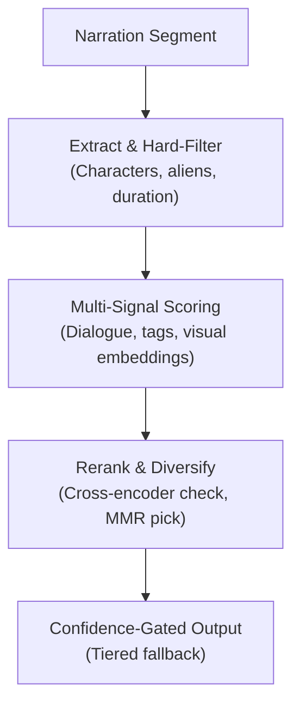

---

## Phase 1: Immediate Tactical Fixes (Zero-Infra & High-ROI Corrections)

The first phase addresses critical bugs and logical flaws in `scripts/clip_matcher.py` that currently cause severe clip starvation and incorrect ranking. These changes require zero additional infrastructure or model training and can be deployed immediately to stabilize retrieval.

### 1.1 Stop Hard-Skipping Clips with Missing Embeddings

In `clip_matcher.py` within the `match_semantic` function (lines 448 to 449), the pipeline executes a hard check that immediately discards any clip lacking a pre-computed vector embedding. When `clip.get("embedding")` evaluates to false, the loop executes a `continue` statement, completely bypassing all subsequent scoring channels. This behavior causes untagged libraries or newly ingested video batches to render as black screens during assembly. Missing a single semantic vector should never zero out the entire utility of a clip, especially when rich metadata such as location tags, visual descriptions, character detections, and subtitle transcripts are available.

To resolve this, the hard skip must be replaced with a conditional evaluation that defaults missing embeddings to a neutral similarity score of zero while allowing the clip to accumulate points through alternative channels. Furthermore, to prevent silent failures during batch processing, the pipeline should execute a startup coverage check that logs a prominent warning when embedding sparsity is detected, rather than relying on manual developer diagnostics.

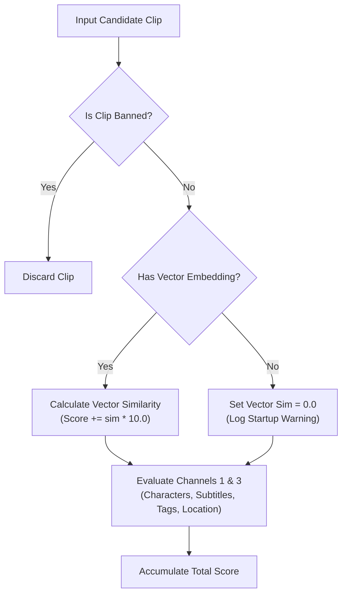

The following code modification must be applied to `scripts/clip_matcher.py` at the beginning of the `match_semantic` function:

```python
# Startup diagnostic warning for missing embeddings across the candidate pool
missing_embeddings = sum(1 for c in clips if not c.get("embedding"))
if missing_embeddings > 0:
    log.warning(
        f"[Coverage Warning] {missing_embeddings}/{len(clips)} clips lack semantic embeddings. "
        "These clips will rely entirely on character, keyword, and subtitle matching."
    )

for clip in clips:
    if _is_banned_clip(clip):
        continue

    # Retrieve embedding safely without hard-skipping the candidate clip
    clip_emb = clip.get("embedding")
    score = 0.0
    reason_parts = []

    # CHANNEL 1: Character Match Score (up to ~20 pts)
    clip_characters = _get_clip_characters(clip)
    proto_dets = clip.get("prototype_detections", {})
```

Subsequently, when calculating the vector similarity in Channel 2 (around line 485), the similarity calculation must conditionally check for the existence of the embedding:

```python
    # CHANNEL 2: Semantic Similarity Score (up to ~15 pts)
    # Calculate dialogue and action vector similarity only if embedding exists
    if clip_emb and segment_embedding:
        sim = cosine_similarity(segment_embedding, clip_emb)
        score += sim * 10.0
        reason_parts.append(f"Vector Sim: {sim:.2f}")
    else:
        sim = 0.0
        reason_parts.append("No Vector Sim")
```

### 1.2 Fix Penalty Logic & Trustworthy Signals

A critical rule of information retrieval is that noisy or probabilistic signals should only ever add positive reinforcement; they must never apply negative subtractions. In `clip_matcher.py` (lines 467 to 470), the character matching logic violates this principle by subtracting four points (`score -= 4.0`) whenever the required narration characters do not intersect with `clip_characters`. Because `clip_characters` is heavily derived from Ollama's vision metadata—which exhibits approximately ninety percent coverage but suffers from frequent hallucinations—the system actively penalizes correct clips simply because the LLM failed to list the character during ingestion.

Negative penalties must be strictly reserved for ground-truth-quality verification layers, specifically the YOLO and ArcFace detections stored in `visual_characters` and `prototype_detections`. If a high-confidence computer vision model actively inspects a frame and confirms the absence of a required character, a subtraction is justified. If the metadata is merely empty or derived from general LLM captioning, the system must remain neutral.

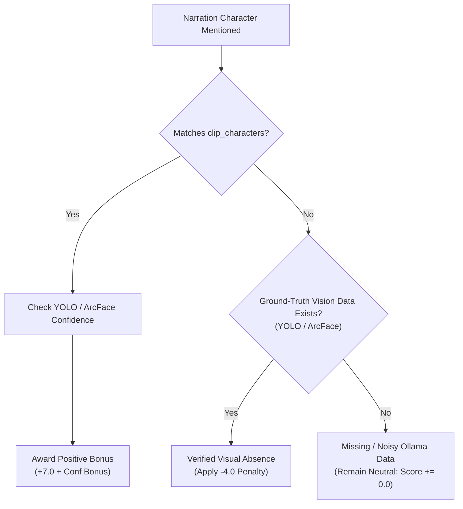

The character scoring block in `scripts/clip_matcher.py` must be refactored to separate ground-truth visual verification from probabilistic text metadata:

```python
        if seg_characters:
            char_overlap = seg_characters & clip_characters
            # Check ground-truth visual detections from YOLO/ArcFace
            has_ground_truth = bool(clip.get("prototype_detections") or clip.get("visual_characters"))
            
            if char_overlap:
                for char in char_overlap:
                    sim = _get_proto_sim(proto_dets, char)
                    conf_bonus = 3.0 * sim if sim > 0 else 2.0
                    score += 7.0 + conf_bonus
                reason_parts.append(f"Chars: {', '.join(char_overlap)}")
            elif has_ground_truth:
                # Ground-truth vision data exists and explicitly confirms absence
                score -= 4.0
                reason_parts.append("Visual Absence Verified")
            else:
                # No vision data or empty LLM metadata; remain neutral without penalty
                reason_parts.append("Char Data Missing/Neutral")
```

### 1.3 Wire in Subtitles with Literal Quote-Matching

Subtitles represent the most reliable, cost-effective unused signal in the video library. However, dialogue text possesses a fundamentally different syntactic and semantic structure compared to visual action descriptions. Combining subtitle text into the general text embedding dilutes the vector space. Subtitles must be embedded separately into a dedicated `subtitle_embedding` field during Phase 1 indexing and evaluated as an independent scoring term.

More importantly, before executing vector similarity calculations, the matcher should perform an exact and fuzzy string-matching pass against the raw subtitle transcript. In anime and cartoon explainers, narration scripts frequently quote iconic dialogue or reference named special moves (for example, "It's hero time!" or "Stinkfly spits high-pressure slime"). When a narration segment exhibits a direct lexical overlap with a clip's spoken dialogue, this literal quote match should act as a high-confidence short-circuit, instantly elevating the clip to the top of the candidate pool.

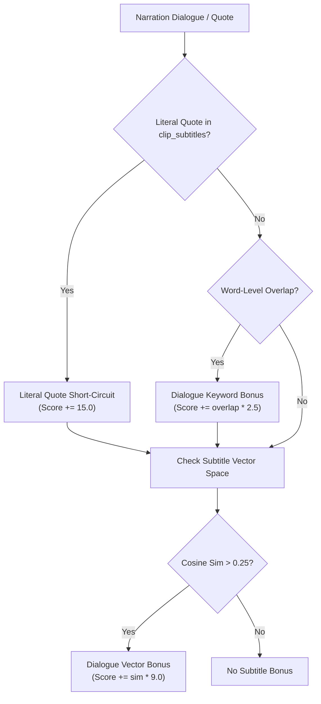

The following implementation must be integrated into `scripts/clip_matcher.py` within the `match_semantic` loop:

```python
        # CHANNEL 1.5: Subtitle & Dialogue Alignment Score
        clip_subtitles = clip.get("subtitles", "").strip().lower()
        seg_text_clean = segment_text.strip().lower()
        
        # Exact or substring quote matching short-circuit
        if clip_subtitles and len(clip_subtitles) > 8:
            if clip_subtitles in seg_text_clean or seg_text_clean in clip_subtitles:
                score += 15.0
                reason_parts.append("Literal Quote Match")
            else:
                # Calculate word-level Jaccard similarity for partial quotes
                sub_words = set(extract_keywords(clip_subtitles))
                if seg_keywords & sub_words:
                    overlap_cnt = len(seg_keywords & sub_words)
                    score += overlap_cnt * 2.5
                    reason_parts.append(f"Dialogue Overlap: {overlap_cnt}")

        # Dedicated semantic similarity against subtitle vector space
        sub_emb = clip.get("subtitle_embedding")
        if sub_emb and segment_embedding:
            sub_sim = cosine_similarity(segment_embedding, sub_emb)
            if sub_sim > 0.25:
                score += sub_sim * 9.0
                reason_parts.append(f"Sub Vector Sim: {sub_sim:.2f}")
```

### 1.4 Finish YOLO/ArcFace Rollout & Close the Alien Form Blind Spot

Deploying the ArcMax YOLO and ArcFace verification pipeline across all hardware units is critical for eliminating character identity failures. However, a significant architectural blind spot exists within ArcFace: it is a facial recognition model engineered specifically for human facial geometry. While it excels at distinguishing Ben Tennyson, Gwen, Kevin Levin, Grandpa Max, and human-form villains, it fails entirely when evaluating Ben's transformed alien forms such as Heatblast, Four Arms, XLR8, or Diamondhead. For a Ben 10 channel, alien transformations represent the primary visual subject matter, yet they currently receive only a soft five-point bonus through noisy text tags.

To close this gap without training custom computer vision models or altering ArcFace, the pipeline should exploit the existing CLIP visual embeddings (`clip_visual_embedding`). Because CLIP aligns images and text within a shared latent space, it does not require detected facial bounding boxes. By pre-computing a static dictionary of descriptive text embeddings for every alien form during system initialization, the matcher can directly compare the clip's visual embedding against reference phrases such as `"a clear photo of Heatblast, a flaming fire alien superhero"` or `"a photo of Four Arms, a giant red four-armed muscular alien"`.

Once this zero-infrastructure visual check is operational, the pipeline should implement a graceful degradation hard-filter cascade. For the named human cast, the matcher enforces an exact match on ground-truth `visual_characters`. If the resulting candidate pool drops below a minimum threshold ($N = 10$), the filter relaxes to accept Ollama text `characters`. If still starved, it falls back to full vector search. For alien forms, visual CLIP alignment remains a strong soft bonus until precision is empirically validated.

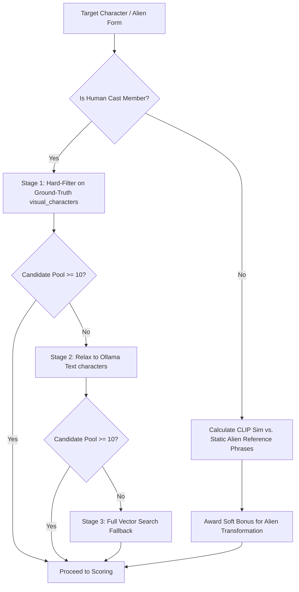

The following helper function and cascade logic must be added to `scripts/clip_matcher.py`:

```python
# Pre-computed CLIP text embeddings for alien forms (initialized at startup)
_ALIEN_REFERENCE_PROMPTS = {
    "heatblast": "a photo of Heatblast, a flaming fire alien superhero made of magma and rocks",
    "four arms": "a photo of Four Arms, a giant red four-armed muscular alien superhero",
    "xlr8": "a photo of XLR8, a blue and black armored dinosaur-like speed alien with wheels on his feet",
    "diamondhead": "a photo of Diamondhead, a crystalline green shard alien made of living crystals",
    "stinkfly": "a photo of Stinkfly, a giant winged insectoid alien superhero with four eyes",
    "upgrade": "a photo of Upgrade, a biomechanical black and green techno-organic alien biomech",
    "cannonbolt": "a photo of Cannonbolt, a bulky white and yellow armored rolling sphere alien",
    "wildmutt": "a photo of Wildmutt, an orange beast-like dog alien with no eyes and sharp teeth"
}

def _get_alien_visual_similarity(clip: dict, alien_name: str) -> float:
    """Calculate CLIP visual similarity against static alien reference phrases."""
    clip_vis = clip.get("clip_visual_embedding")
    if not clip_vis or alien_name.lower() not in _ALIEN_REFERENCE_PROMPTS:
        return 0.0
    
    encoder = _get_clip_text_encoder()
    if not encoder:
        return 0.0
        
    ref_text = _ALIEN_REFERENCE_PROMPTS[alien_name.lower()]
    ref_emb = encoder.encode(ref_text).tolist()
    return cosine_similarity(ref_emb, clip_vis)
```

---

## Phase 2: Structural Upgrades & Scoring Foundations

Phase 2 replaces the brittle mathematical assumptions of the legacy matcher with robust information retrieval frameworks. These structural changes ensure that the system scales cleanly as new metadata channels are introduced.

### 2.1 Push Metadata Generation Upstream into Script Generation

The most transformative structural upgrade is shifting shot specification upstream into the script generation phase. Currently, `scripts/script_generator.py` prompts Ollama to produce continuous narrative prose. When `clip_matcher.py` later attempts to find video clips, it must reverse-engineer what should appear on screen by computing embedding similarities over the spoken narration. This prose-to-prose matching inherently favors general semantic tone over concrete visual requirements.

When the large language model writes each narration segment, it possesses exact knowledge of the visual action being described. By modifying the script generation prompt to emit structured JSON objects containing both the spoken narration and precise shot metadata, the pipeline transforms clip retrieval from vague vector similarity into exact slot-filling. The required metadata slots include mandatory character lists, specific action verbs, alien transformation states, desired shot framing (wide, medium, close-up, action), and key quotes.

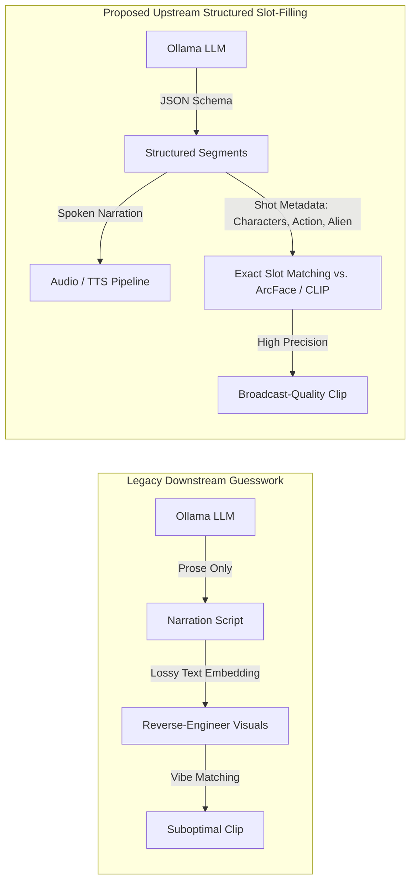

To implement this, `scripts/script_generator.py` must be updated to enforce JSON schema output from Ollama:

```python
def build_structured_script_prompt(topic: str, show: dict, pipeline_config: dict, rag_manager: RAGManager = None) -> str:
    """Build a prompt that mandates structured JSON output containing narration and shot metadata."""
    context = rag_manager.get_combined_context(topic) if rag_manager else ""
    show_name = show.get("display_name", "Ben 10")
    
    prompt = f"""You are an expert anime and cartoon video essay writer and director for the show '{show_name}'.
Write an engaging narration script for the topic: "{topic}".

You MUST respond with a valid JSON object containing an array of script segments. Each segment must specify both the spoken narration and the precise visual shot metadata required for the video editor.

Use the exact JSON schema below:
{{
  "segments": [
    {{
      "narration": "When Ben first slammed down the Omnitrix, he didn't expect to turn into a walking volcano.",
      "shot_metadata": {{
        "characters": ["Ben Tennyson"],
        "action_verb": "slamming the Omnitrix watch down",
        "alien_form": "Heatblast",
        "shot_type": "closeup",
        "key_quote": "walking volcano"
      }}
    }},
    {{
      "narration": "Vilgax immediately deployed his bio-mechanical drones to retrieve the weapon.",
      "shot_metadata": {{
        "characters": ["Vilgax", "Drones"],
        "action_verb": "drones flying and attacking",
        "alien_form": null,
        "shot_type": "action",
        "key_quote": "retrieve the weapon"
      }}
    }}
  ]
}}

Reference Context:
{context}

Return ONLY the valid JSON object without any introductory text or markdown formatting."""
    return prompt
```

When `clip_matcher.py` receives these structured segments, it directly matches `shot_metadata["characters"]` against ArcFace detections, `shot_metadata["alien_form"]` against CLIP reference embeddings, and `shot_metadata["action_verb"]` against visual action tags, eliminating Failure Mode #3 entirely.

### 2.2 Replace Weighted-Sum Scoring with Reciprocal Rank Fusion (RRF)

The legacy scoring function in `clip_matcher.py` sums raw cosine similarities, integer overlap counts, and arbitrary scalar bonuses using uncalibrated multipliers ($\times 10.0, \times 8.0, \times 7.0, -4.0$). Because cosine similarities live on a bounded $[0, 1]$ interval while keyword overlap counts scale linearly with sentence length, these signals exist on completely incompatible numerical scales. Adjusting a weight to fix a retrieval error in one episode inevitably distorts ranking in another.

Reciprocal Rank Fusion (RRF) resolves this mathematically by decoupling scoring from absolute signal values. Instead of summing raw scores, RRF sorts all candidate clips independently across each retrieval channel—producing a separate rank order for semantic text similarity, visual CLIP similarity, subtitle overlap, and character verification. The final unified score is calculated by summing the inverse rank positions:

$$S_{\text{RRF}}(d \in D) = \sum_{m \in M} \frac{1}{k + r_m(d)}$$

Where $D$ is the pool of candidate clips, $M$ is the set of retrieval channels, $r_m(d)$ is the 1-indexed rank position of clip $d$ in channel $m$, and $k$ is a smoothing constant (standardly set to $60$) that mitigates the impact of outlier rankings. RRF requires no hand-tuned weights, handles scale disparities natively, and represents the industry standard for combining heterogeneous retrieval signals.

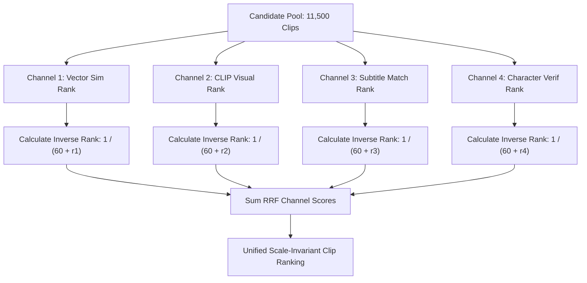

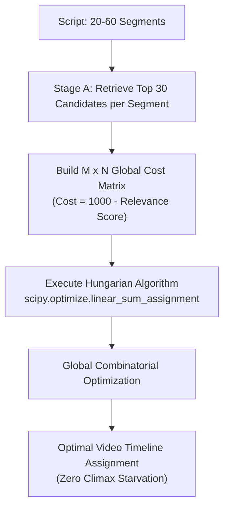

The following implementation must be integrated into `scripts/assembler.py`:

```python
def compute_rrf_scores(clips: list, channel_scores: dict, k: int = 60) -> list:
    """Combine heterogeneous scoring channels using Reciprocal Rank Fusion (RRF).
    
    channel_scores maps channel names to dictionaries of {clip_filename: raw_score}.
    """
    rrf_totals = {clip.get("filename"): 0.0 for clip in clips}
    clip_map = {clip.get("filename"): clip for clip in clips}
    
    # Iterate through each independent scoring channel
    for channel_name, score_map in channel_scores.items():
        # Sort clips descending by their raw score in this specific channel
        sorted_filenames = sorted(score_map.keys(), key=lambda fname: score_map[fname], reverse=True)
        
        # Award RRF points based purely on rank position
        for rank_idx, fname in enumerate(sorted_filenames, start=1):
            if score_map[fname] > 0:  # Only award rank points if the signal was active
                rrf_totals[fname] += 1.0 / (k + rank_idx)
                
    # Format sorted output tuples matching pipeline expectations: (rrf_score, raw_rrf, clip_obj, reason)
    ranked_results = []
    for fname, rrf_score in sorted(rrf_totals.items(), key=lambda x: x[1], reverse=True):
        clip_obj = clip_map[fname]
        ranked_results.append((rrf_score, rrf_score, clip_obj, f"RRF Unified Rank (Score: {rrf_score:.4f})"))
        
    return ranked_results
```

### 2.3 Build a Labeled Evaluation Set & Scoreboard

None of the proposed retrieval enhancements can be scientifically validated without a static evaluation benchmark. Modifying scoring formulas based on visual inspection of sample outputs inevitably leads to regression loops. To establish a reliable scoreboard, the project must construct a gold-standard evaluation dataset comprising fifty to one hundred labeled `(narration_segment, ground_truth_clip_filename)` pairs.

This dataset can be bootstrapped cheaply without manual annotation by leveraging an LLM in reverse. By feeding an offline script the `episode_summary` and `scene_context` of fifty distinct, highly engaging clips from across the series, the LLM can be prompted to write a single sentence of broadcast narration that specifically describes the unique action in each clip. Because the originating clip filename is known during generation, this automatically yields a perfect ground-truth evaluation pair.

A dedicated evaluation script, `scripts/eval_retrieval.py`, must be created to measure pipeline accuracy against this benchmark before and after every codebase modification. The primary metrics tracked must be Precision@1 (percentage of times the exact ground-truth clip is ranked first) and Precision@5 (percentage of times the ground-truth clip appears in the top five shortlist):

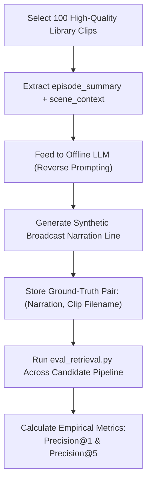

```python
"""
scripts/eval_retrieval.py — Automated Evaluation Harness for Clip Retrieval
"""
import json
from pathlib import Path
from clip_matcher import match_semantic
from config_loader import load_pipeline_config, get_active_show

def run_evaluation_harness(eval_dataset_path: str = "tests/eval_dataset.json"):
    config = load_pipeline_config()
    show = get_active_show(config)
    
    with open(eval_dataset_path, "r", encoding="utf-8") as f:
        eval_pairs = json.load(f)
        
    with open("clip_index.json", "r", encoding="utf-8") as f:
        all_clips = json.load(f)
        
    total_queries = len(eval_pairs)
    hits_at_1 = 0
    hits_at_5 = 0
    
    print(f"--- Starting Retrieval Evaluation over {total_queries} Benchmark Pairs ---")
    
    for idx, item in enumerate(eval_pairs, start=1):
        query_text = item["narration_segment"]
        ground_truth_fname = item["expected_clip_filename"]
        
        # Execute retrieval without cooldowns or episode biases
        top_clips, _, _ = match_semantic(
            segment_text=query_text,
            clips=all_clips,
            show_config=show,
            embedding_model=None,  # Loaded internally by matcher
            threshold=0.0
        )
        
        retrieved_fnames = [c.get("filename") for c in top_clips[:5]]
        
        if retrieved_fnames and retrieved_fnames[0] == ground_truth_fname:
            hits_at_1 += 1
        if ground_truth_fname in retrieved_fnames:
            hits_at_5 += 1
            
    p_at_1 = (hits_at_1 / total_queries) * 100.0
    p_at_5 = (hits_at_5 / total_queries) * 100.0
    
    print(f"\n==========================================")
    print(f"RETRIEVAL SCOREBOARD RESULTS")
    print(f"==========================================")
    print(f"Precision@1: {p_at_1:.2f}% ({hits_at_1}/{total_queries})")
    print(f"Precision@5: {p_at_5:.2f}% ({hits_at_5}/{total_queries})")
    print(f"==========================================\n")

if __name__ == "__main__":
    run_evaluation_harness()
```

---

## Phase 3: Advanced Retrieval, Reranking & Global Assembly

Once the mathematical foundations and evaluation harness are established, Phase 3 upgrades the assembly engine. These advanced techniques solve complex video editing challenges such as narrative pacing, visual diversity, and temporal continuity.

### 3.1 Two-Stage Retrieval (Retrieve Cheap, Verify Expensive)

Bi-encoders such as MiniLM and CLIP are computationally efficient because they encode queries and documents independently into static vectors. However, they suffer from a fundamental lack of deep semantic discrimination; they match general environmental vibes rather than specific relational actions. When a narration segment requests "Vilgax throwing Ben through a brick wall," a bi-encoder frequently retrieves scenes of Ben standing near a brick wall or Vilgax talking on his ship.

To achieve deep comprehension without incurring extreme latency, the retrieval architecture must transition to a two-stage paradigm: retrieve cheap, verify expensive.

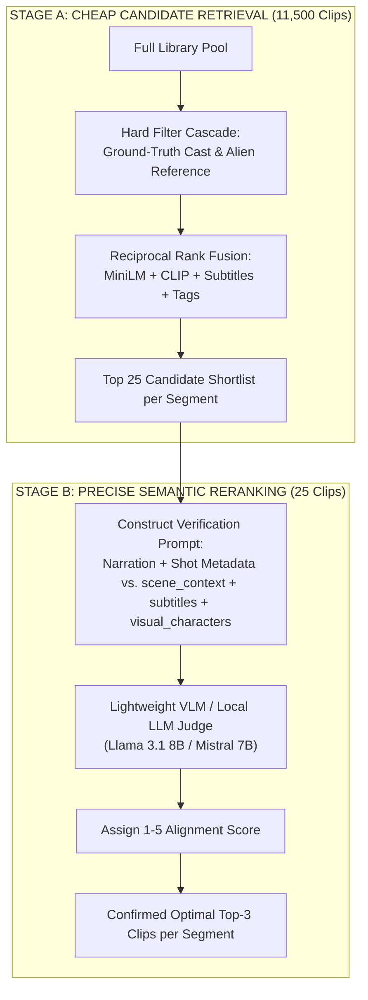

In Stage A, the system applies RRF and cascading hard filters across the full 11,500-clip library to rapidly prune the search space down to a shortlist of twenty-five high-probability candidates per segment. This step executes in milliseconds. In Stage B, the system dedicates computational resources to precisely verifying only those twenty-five candidates. It constructs a structured prompt containing the segment's narration and shot metadata alongside each candidate's rich textual transcripts (`scene_context`, `subtitles`, `visual_characters`, and `action`). A fast local LLM (such as Llama 3.1 8B or Mistral 7B via Ollama) evaluates the shortlist and assigns a precise semantic alignment score from one to five. Because this verification runs only on the shortlist, it requires minimal API or GPU overhead while completely eliminating vibe-matching hallucinations.

### 3.2 Global Segment Assignment via Hungarian Algorithm

In the existing pipeline, `scripts/assembler.py` iterates through script segments sequentially from beginning to end, calling `match_semantic` for each sentence. This greedy selection strategy creates severe resource bottlenecks: an introductory segment mentioning "the Omnitrix" might consume the single best close-up animation clip in the library, leaving a climax segment that specifically analyzes that exact animation mechanism with no valid clips remaining. Cooldown windows only prevent immediate repetition; they cannot retroactively reassign clips to where they are most narratively impactful.

Because a standard video script contains only twenty to sixty narration segments, and Stage A retrieval provides twenty-five candidates per segment, the entire video assembly problem can be solved exactly as a global combinatorial optimization task. By constructing an $M \times N$ cost matrix—where rows represent script segments, columns represent candidate clips across the library, and cell values represent inverted relevance scores—the pipeline can apply the Hungarian Algorithm (`scipy.optimize.linear_sum_assignment`). This mathematical optimization finds the exact global assignment that maximizes total video-wide relevance simultaneously, ensuring that critical scenes receive their optimal visual assets without starving adjacent segments.

The following implementation must be integrated into `scripts/assembler.py`:

```python
import numpy as np
from scipy.optimize import linear_sum_assignment

def optimize_global_clip_assignment(script_segments: list, all_clips: list, show_config: dict) -> list:
    """Assign clips to script segments globally to maximize total video relevance."""
    num_segments = len(script_segments)
    
    # Collect top candidates across all segments to build a condensed global pool
    candidate_pool = {}
    segment_candidate_scores = []
    
    for seg_idx, segment_text in enumerate(script_segments):
        top_clips, _, _ = match_semantic(
            segment_text=segment_text,
            clips=all_clips,
            show_config=show_config,
            embedding_model=None,
            threshold=0.0
        )
        # Store top 30 candidates per segment
        scores_map = {}
        for clip_obj, reason in top_clips[:30]:
            fname = clip_obj.get("filename")
            candidate_pool[fname] = clip_obj
            # Retrieve raw RRF or similarity score from reason/object
            scores_map[fname] = clip_obj.get("_last_score", 10.0)
        segment_candidate_scores.append(scores_map)
        
    unique_filenames = list(candidate_pool.keys())
    num_candidates = len(unique_filenames)
    fname_to_col = {fname: col_idx for col_idx, fname in enumerate(unique_filenames)}
    
    # Build cost matrix (Scipy minimizes cost, so we invert relevance scores: cost = 1000 - score)
    cost_matrix = np.full((num_segments, num_candidates), fill_value=1000.0, dtype=np.float32)
    
    for row_idx, scores_map in enumerate(segment_candidate_scores):
        for fname, score in scores_map.items():
            col_idx = fname_to_col[fname]
            cost_matrix[row_idx, col_idx] = 1000.0 - score
            
    # Solve global linear sum assignment (Hungarian Algorithm)
    row_ind, col_ind = linear_sum_assignment(cost_matrix)
    
    # Construct optimal timeline sequence
    optimal_timeline = []
    for seg_idx, col_idx in zip(row_ind, col_ind):
        assigned_fname = unique_filenames[col_idx]
        optimal_timeline.append({
            "segment_index": seg_idx,
            "narration": script_segments[seg_idx],
            "clip": candidate_pool[assigned_fname]
        })
        
    return optimal_timeline
```

### 3.3 Maximal Marginal Relevance (MMR) for Diversity

To prevent repetitive video editing, the current system combines two uncoordinated heuristics: a flat cooldown zero-out penalty that bans recently used filenames, and a flat two-point bonus for clips originating from the same episode as the dominant scene. These heuristics frequently pull in opposite directions and fail to recognize visual duplicates across different episodes (for example, eight consecutive cuts of Ben transforming in front of a forest background from different seasons).

These competing hacks must be replaced with Maximal Marginal Relevance (MMR). MMR balances two explicit objectives within a single mathematical formulation: relevance to the narration query, and visual diversity relative to previously selected clips in the timeline.

$$\text{MMR\_Score}(C_i) = \lambda \cdot \text{Sim}_{\text{text}}(Q, C_i) - (1 - \lambda) \cdot \max_{C_j \in S} \text{Sim}_{\text{visual}}(C_i, C_j)$$

Where $Q$ is the narration segment, $C_i$ is a candidate clip, $S$ is the set of clips already assigned to earlier timeline positions, $\text{Sim}_{\text{text}}$ is the semantic relevance score, $\text{Sim}_{\text{visual}}$ is the cosine similarity between the candidate's `clip_visual_embedding` and the embeddings of previously selected clips, and $\lambda$ is a tuning parameter (calibrated to $0.7$). By explicitly subtracting the maximum visual similarity against the existing timeline, MMR naturally penalizes repetitive forest backgrounds or identical character framing without requiring arbitrary filename cooldowns.

### 3.4 Co-Designed Duration Filtering & Clip Adaptation

A major source of visual artifacts is Failure Mode #6, where clips are discarded because their physical duration does not perfectly match the pre-segmented narration sentence. Currently, `assembler.py` locks narration segment boundaries first, calculates spoken duration, and then hard-filters the video library for clips between 1.3 and 5.0 seconds. High-relevance action clips that happen to be 1.1 seconds or 6.5 seconds long are discarded entirely.

Segmentation and clip selection must be co-designed as an interactive process. The speech generation pipeline utilizes OpenAI Whisper to produce exact word-level audio timestamps before video assembly begins. When a top-ranked candidate clip is slightly shorter or longer than the initial sentence boundary, the assembler should flex the audio timestamp window by splitting or grouping adjacent clauses at natural syntactic pauses, adapting the narration boundary to fit the optimal visual asset.

Furthermore, instead of discarding incompatible durations, `assembler.py` must actively adapt clip media:
1. **Speed-Ramping Short Clips**: If an optimal action clip is 1.5 seconds long but the narration segment requires 2.0 seconds, the assembler should apply smooth optical-flow interpolation or speed-ramping (slow down playback by up to twenty-five percent) to stretch the clip without visible stutter. Very brief loops (<1.0s) can utilize ping-pong looping for background character reactions.
2. **Confidence-Gated Sub-Window Trimming**: When an optimal clip is 12.0 seconds long but the segment requires only 3.5 seconds, the assembler must not blindly take the first three seconds. By leveraging the per-frame ArcMax character confidence and motion vectors stored in `detection_meta`, the assembler scans the clip to extract the exact 3.5-second sub-window that exhibits the highest character recognition confidence and peak visual motion.

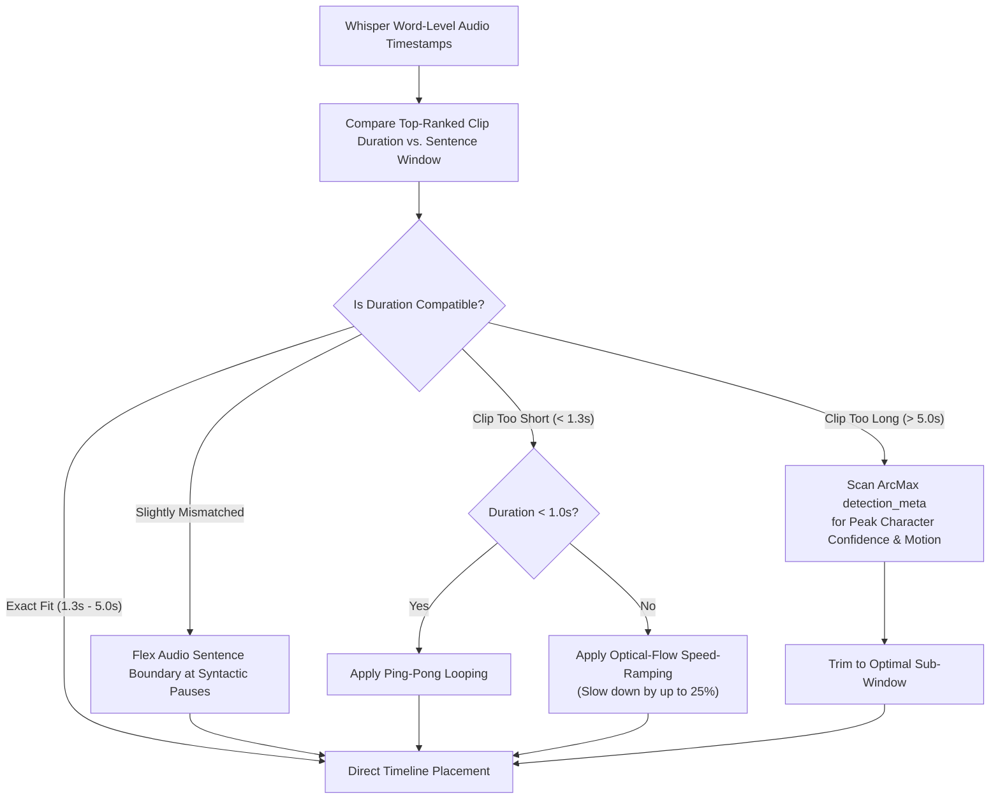

### 3.5 Temporal Context Biasing

Video essays frequently explain narrative arcs using chronological transitional phrasing, such as "immediately after the explosion," "later that night," "before Vilgax arrived," or "the following morning." The legacy matcher ignores these temporal markers, treating every sentence as an isolated semantic query. This causes jarring visual jumps where a scene from Season 3 Episode 10 is followed immediately by an establishing shot from Season 1 Episode 2 simply because the keyword vectors aligned.

Because episode and scene indices are explicitly encoded in project filenames (for example, `s01e04_scene_042.mp4`), temporal continuity can be enforced with zero additional indexing overhead. The matcher should scan narration segments for sequential connective language. When forward-advancing markers ("then", "after", "next", "consequently") are detected, the retrieval engine applies a Gaussian scoring bias that favors candidate clips originating from scene indices immediately following the previously selected scene within the same episode. Conversely, retrospective markers ("earlier", "previously", "before") bias retrieval toward preceding scene indices, creating natural, professional cinematic continuity.

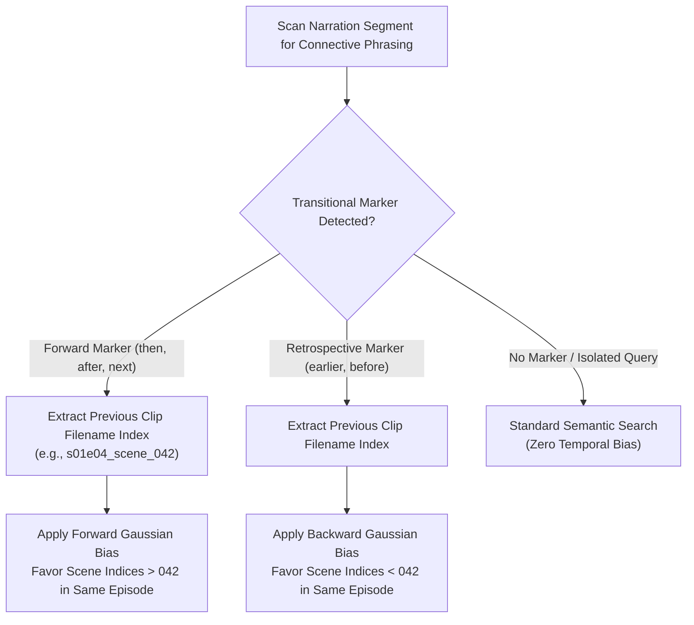

### 3.6 Vector Database Indexing (ChromaDB / pgvector)

As the video library scales toward tens of thousands of clips across multiple Ben 10 series, iterating through 11,500 JSON objects and computing cosine similarities in a brute-force Python loop will create severe CPU bottlenecks during rendering. The retrieval engine must be migrated from in-memory arrays to a dedicated vector database index, specifically ChromaDB or pgvector within the AIForge infrastructure.

During Phase 1 indexing, each clip's `embedding`, `clip_visual_embedding`, and `subtitle_embedding` must be ingested into separate vector collections alongside structured metadata payloads containing `visual_characters`, `transformations`, `location`, and `season_episode`. During assembly, Stage A retrieval executes via Approximate Nearest Neighbor (ANN) hierarchical navigable small world (HNSW) queries. By pushing the hard-filter cascade directly into the database query predicate—such as `WHERE visual_characters CONTAINS 'Heatblast' AND duration >= 1.5`—the matcher retrieves top candidate shortlists in sub-millisecond execution times while reducing system memory overhead.

---

## Implementation Roadmap & Priority Ranking

To ensure rapid stabilization without disrupting ongoing video production, the proposed architectural upgrades must be executed in a strict priority sequence based on effort-to-payoff ratio. Immediate zero-infrastructure code modifications take precedence over structural refactoring and advanced optimization algorithms.

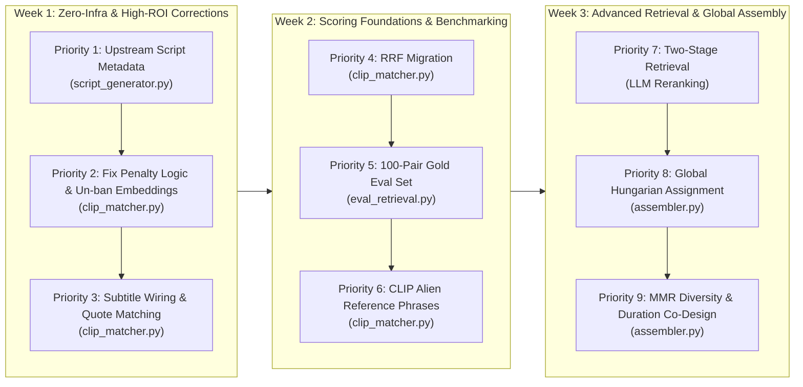

### Priority 1: Upstream Script Metadata in `script_generator.py` (Item #4)
* **Effort**: Low (Prompt engineering and JSON schema parsing in `script_generator.py`).
* **Payoff**: Exceptional. This is the single highest-leverage structural change. By forcing the narration LLM to output structured shot specifications (`characters`, `action_verb`, `alien_form`, `shot_type`) alongside prose, the matcher transforms from guessing visual content via lossy text embeddings into exact factual slot-matching. This eliminates Failure Mode #3 at the root.

### Priority 2: Fix Penalty Logic & Un-ban Missing Embeddings (Items #2 & #1)
* **Effort**: Low (Ten lines of refactored conditional logic in `clip_matcher.py`).
* **Payoff**: Very High. Stop subtracting four points for missing Ollama character data; restrict negative penalties strictly to ground-truth YOLO/ArcFace visual absences. Simultaneously, remove the `continue` statement on line 448 that hard-skips clips without vectors, replacing it with a neutral zero similarity score and a startup warning. This immediately cures library black screens and stops punishing correct clips for noisy LLM metadata.

### Priority 3: Subtitle Integration & Literal Quote Matching (Item #5)
* **Effort**: Low to Medium (Wiring existing subtitle text and vectors into `clip_matcher.py`).
* **Payoff**: High. Subtitles represent the cheapest unused signal. Adding an exact/substring text-matching short-circuit immediately captures direct dialogue quotes ("It's hero time!"), while dedicated subtitle vector similarity provides clean dialogue alignment without diluting visual action embeddings.

### Priority 4: Reciprocal Rank Fusion Migration (Item #1 - RRF)
* **Effort**: Medium (Refactoring the sorting and combination loop in `clip_matcher.py`).
* **Payoff**: High. Replacing raw weighted cosine sums with inverse rank summation ($1/(60 + \text{rank})$) makes the scoring engine mathematically robust to scale disparities between similarities and integer overlap counts, permanently eliminating the need to hand-tune weights when field coverage shifts.

### Priority 5: Build Gold Evaluation Set & Scoreboard (Item #8)
* **Effort**: Medium (Creating `scripts/eval_retrieval.py` and reverse-prompting an LLM over 100 clips).
* **Payoff**: Foundational. Provides empirical Precision@1 and Precision@5 metrics. Without this scoreboard, all subsequent modifications to reranking, MMR, or vector database indexing cannot be proven to improve video quality over subjective feel.

### Priority 6: CLIP Reference Phrases for Alien Forms (Item #7)
* **Effort**: Low (Defining static text prompts for eight alien forms and matching against `clip_visual_embedding`).
* **Payoff**: Medium-High. Closes ArcFace's human-only blind spot by leveraging existing CLIP visual vectors to identify Ben's transformed alien states with zero additional computer vision training or GPU inference overhead.

### Priority 7: Two-Stage Retrieval & LLM Reranking (Item #3)
* **Effort**: High (Integrating a Stage B verification call into the assembly pipeline).
* **Payoff**: High. Uses cheap RRF filtering to prune 11,500 clips down to twenty-five candidates, then deploys a lightweight local LLM judge to evaluate exact semantic alignment over rich clip transcripts, completely eradicating bi-encoder vibe-matching errors.

### Priority 8: Global Hungarian Algorithm Assignment (Item #9)
* **Effort**: High (Replacing sequential loop in `assembler.py` with Scipy matrix optimization).
* **Payoff**: High. Solves video assembly globally across all script segments simultaneously, guaranteeing that high-value climax scenes receive optimal clips rather than losing them to early introductory segments.

### Priority 9: MMR Diversity & Duration Co-Design (Items #6 & #10)
* **Effort**: High (Implementing MMR equation and audio timestamp flexing in `assembler.py`).
* **Payoff**: Medium-High. Replaces uncoordinated cooldown hacks with mathematically principled visual diversity ($\lambda = 0.7$), while adapting clip durations via speed-ramping and ArcMax confidence sub-window trimming instead of discarding high-relevance media.
