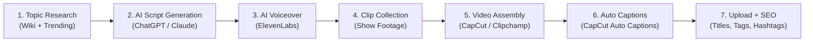
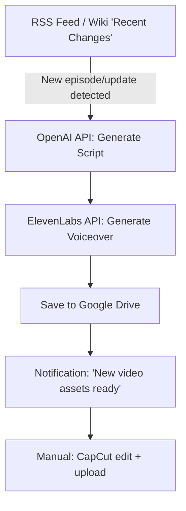

# 🔬 Deep Research: ThinkAlto & NyleTrix YouTube Channels
## + Full Implementation Plan to Build Your Own AI-Powered Channel

---

## 📊 Channel Profiles

### @ThinkAlto
| Metric | Detail |
|---|---|
| **Niche** | Rick and Morty — theories, hidden details, lore analysis |
| **Format** | YouTube Shorts (primary), some long-form |
| **Subscribers** | ~9.2K+ |
| **Total Videos** | ~157 |
| **Engagement Rate** | ~5.3% (likes/views — considered strong for Shorts) |
| **Content Style** | Faceless narration over show clips + text overlays |
| **Upload Cadence** | High frequency (multiple per week) |

### @NyleTrix
| Metric | Detail |
|---|---|
| **Niche** | Ben 10 — Omnitrix analysis, alien theories, lore breakdowns |
| **Format** | YouTube Shorts (primary) |
| **Subscribers** | Growing (niche but devoted fandom) |
| **Content Style** | Faceless narration over animated clips + text overlays |
| **Upload Cadence** | High frequency |

---

## 🧠 How They're Getting Views — The Growth Engine Breakdown

### 1. Niche Selection Is the Secret Weapon
Both channels exploit **nostalgic, evergreen IPs** with massive search volume:
- **Rick and Morty**: Ongoing series, billions of total views on YouTube, highly meme-able, passionate theory community
- **Ben 10**: Nostalgic franchise (2005+), multiple series, dedicated fandom that actively searches for lore content

> [!IMPORTANT]
> These aren't random niches. They are **high-search, low-competition theory niches** where SHORT-FORM content is underserved compared to long-form. The fanbases actively search for "hidden details", "what if" scenarios, and "things you didn't know."

### 2. The Shorts Algorithm Advantage
Both channels are **Shorts-first**. This is deliberate:
- Shorts get pushed to a **separate algorithmic feed** (Shorts Shelf) with much lower competition than long-form
- **Shorter production time** = higher upload frequency = more algorithmic "lottery tickets"
- Shorts virality is driven by **retention rate** and **re-watch loops**, not subscriber count
- A channel with 1K subscribers can get 500K+ views on a single Short if retention is high

### 3. Parasitic SEO / IP Piggybacking
Both channels ride the coattails of established IPs:
- Titles contain the IP name ("Rick and Morty", "Ben 10", "Omnitrix")
- Hashtags like `#rickandmorty`, `#ben10`, `#omnitrix`, `#cartoon`, `#theory`
- YouTube's recommendation engine pushes this content to anyone watching related videos

### 4. The "Theory" Content Angle
Theory/lore content is the **highest retention format** for animated show niches because:
- It creates a **curiosity gap** ("Wait, is that actually true?")
- It triggers **emotional engagement** (nostalgia + surprise)
- It encourages **comments** ("I always thought that too!" / "No way, you're wrong!")
- Comments and rewatches signal to the algorithm that the video is high-quality

---

## 📝 Script Anatomy — Reverse Engineering Their Formula

### The Universal Short Script Structure (25–45 seconds)

Both channels follow a remarkably consistent pattern:

```
┌─────────────────────────────────────────────────┐
│  HOOK (0-3 seconds)                             │
│  Bold claim / shocking question / pattern break │
│  "Rick actually LIED about the Central Finite   │
│   Curve"                                        │
├─────────────────────────────────────────────────┤
│  PROOF / SETUP (3-12 seconds)                   │
│  One specific piece of evidence that creates     │
│  an "information debt" the viewer must resolve   │
│  "In Season 3 Episode 7, look closely at..."    │
├─────────────────────────────────────────────────┤
│  ESCALATION (12-30 seconds)                     │
│  Build the theory step by step. Short punchy    │
│  sentences. Each sentence adds a new layer.     │
│  Use rhetorical questions every 2-3 sentences.  │
├─────────────────────────────────────────────────┤
│  PAYOFF + LOOP (Final 5 seconds)                │
│  Deliver the conclusion. End with a line that   │
│  makes the viewer want to rewatch or comment.   │
│  "And THAT'S why [callback to hook]..."         │
└─────────────────────────────────────────────────┘
```

### Example Script (ThinkAlto Style — Rick and Morty)

```
[HOOK - 0:00-0:03]
"Evil Morty didn't just escape — he REPLACED someone."

[PROOF - 0:03-0:10]
"In the Ricklantis Mixup, there's a frame where Evil Morty's
eye patch switches sides. Most people thought it was an
animation error. But Dan Harmon doesn't make errors."

[ESCALATION - 0:10-0:30]
"Look at Morty's behavior in Season 5. He's colder. More
calculated. Almost... Rickish. What if Evil Morty didn't
just leave the Central Finite Curve — he replaced OUR Morty
before the finale? Think about it: why would the show
deliberately change Morty's personality unless he's literally
a different person?"

[PAYOFF - 0:30-0:38]
"Evil Morty didn't escape the curve. He escaped INTO our
timeline. And nobody noticed. Yet."
```

### Example Script (NyleTrix Style — Ben 10)

```
[HOOK - 0:00-0:03]
"The Omnitrix has NEVER scanned this alien — and there's
a terrifying reason why."

[PROOF - 0:03-0:10]
"In Alien Force, Azmuth specifically locks out one species
from the Omnitrix's scan range. He calls it a 'precaution.'
But that's a lie."

[ESCALATION - 0:10-0:28]
"The species he locked out? The Contemelia. They're fifth-
dimensional beings. The Omnitrix can scan DNA, but Contemelia
don't HAVE DNA — they exist as pure perception. If Ben
scanned one, the Omnitrix wouldn't just crash. It would try
to rewrite reality itself."

[PAYOFF - 0:28-0:35]
"Azmuth didn't lock them out to protect Ben. He locked them
out to protect the UNIVERSE."
```

### Why Their Scripts Feel "So Accurate"

> [!TIP]
> The scripts feel accurate because they follow a **truth-sandwiching** technique:
> 1. **Start with a real fact** from the show (verifiable, builds trust)
> 2. **Layer a logical theory** on top (feels plausible, not random)
> 3. **End with a dramatic conclusion** (emotionally satisfying)
>
> AI (ChatGPT/Claude) is perfect for this because:
> - These shows have extensive wiki pages that LLMs have been trained on
> - LLMs can generate logically consistent theories from known lore
> - The creator only needs to **fact-check 1-2 key details** per script

---

## 🎬 Production Pipeline — How It's All Assembled

### Evidence This Is AI-Powered (with minimal manual effort):

| Indicator | ThinkAlto | NyleTrix |
|---|---|---|
| **Voiceover** | Consistent AI-like cadence, no natural pauses/breaths, no filler words ("um", "uh") | Same — clean, rhythmic narration with no human imperfections |
| **Upload Frequency** | Multiple shorts per week — unsustainable for manual scriptwriting | Same pattern |
| **Script Consistency** | Every video follows the EXACT same hook→proof→escalate→payoff structure | Identical structure |
| **Visual Style** | Clips from the show + text overlays + zoom effects | Same approach |
| **No Face, No Personality** | Zero personal branding, no "host" presence | Same |
| **Subtitles** | Bold, dynamic, CapCut-style auto captions | Same style |

### Their Likely Production Stack



### Estimated Time Per Video (After System Is Set Up)

| Step | Time | Manual vs AI |
|---|---|---|
| Topic selection | 2 min | Manual (browse wiki/trends) |
| Script generation | 2 min | AI (prompt → output) |
| Script review/edit | 3 min | Manual (fact-check 1-2 claims) |
| Voiceover generation | 1 min | AI (paste script → download) |
| Find/download clips | 5 min | Manual (most time-intensive step) |
| Video assembly | 5 min | Semi-manual (CapCut template) |
| Add captions | 1 min | AI (CapCut auto captions) |
| Upload + metadata | 2 min | Manual (copy-paste optimized title) |
| **Total** | **~20 min** | **~80% AI, ~20% manual** |

---

## 🏗️ IMPLEMENTATION PLAN: Build Your Own AI Channel

### Phase 0: Strategic Decisions (Day 1)

```
┌──────────────────────────────────────────────────────────────┐
│                    CHOOSE YOUR NICHE                         │
│                                                              │
│  Requirements:                                               │
│  ✅ Massive existing fanbase (search volume)                 │
│  ✅ Deep lore (enables endless theory content)               │
│  ✅ Nostalgia factor (emotional hook)                        │
│  ✅ Active online community (Reddit, Wiki, Discord)          │
│  ✅ Ongoing/recent content (keeps it relevant)               │
│                                                              │
│  Proven Niches:                                              │
│  • Dragon Ball Z/Super    • One Piece                        │
│  • Naruto/Boruto          • Avatar: The Last Airbender       │
│  • Pokémon                • SpongeBob (surprisingly huge)    │
│  • Marvel animated        • DC animated                      │
│  • Gravity Falls          • Adventure Time                   │
│  • My Hero Academia       • Demon Slayer                     │
│  • Rick and Morty ✓       • Ben 10 ✓                         │
└──────────────────────────────────────────────────────────────┘
```

> [!WARNING]
> **Copyright Risk**: Using show clips carries copyright strike risk. Mitigations:
> - Keep clips short (2-4 seconds each)
> - Add heavy visual modifications (zoom, blur, overlays, color grading)
> - Frame content as "commentary/analysis" (fair use defense)
> - Consider generating AI visuals with Midjourney/Leonardo AI instead of using show clips
> - Never use raw, unedited footage

---

### Phase 1: Tool Setup (Day 1-2)

#### Required Tools (Total Cost: ~$15-30/month)

| Tool | Purpose | Cost |
|---|---|---|
| **ChatGPT Plus** or **Claude Pro** | Script generation | $20/mo |
| **ElevenLabs** (Starter Plan) | AI voiceover | Free tier (10K chars) or $5/mo |
| **CapCut** (Desktop, Free) | Video editing + auto captions | Free |
| **VidIQ** (Free Tier) | Keyword research + trending topics | Free |
| **Google Trends** | Validate topic demand | Free |
| **Fandom Wiki** | Source material for accurate scripts | Free |
| **YouTube Studio** | Upload + analytics | Free |

#### Optional Power Tools

| Tool | Purpose | Cost |
|---|---|---|
| **Leonardo AI** / **Midjourney** | AI-generated visuals (avoid copyright) | $10-12/mo |
| **Make.com** | Workflow automation (connect tools) | Free tier available |
| **n8n** (self-hosted) | Advanced automation pipelines | Free |
| **Opus Clip** | Repurpose long-form into Shorts | Freemium |

---

### Phase 2: Build Your Script Generation System (Day 2-3)

#### The Master Prompt (Save this — it's the core engine)

```markdown
You are a viral YouTube Shorts scriptwriter specializing in 
[YOUR NICHE] theory/analysis content.

RULES:
1. Scripts MUST be 25-40 seconds when read aloud (~75-100 words)
2. Use this EXACT structure:
   - HOOK (0-3s): Bold claim, shocking question, or pattern 
     interrupt. NEVER start with "In this video" or greetings.
   - PROOF (3-10s): One specific, verifiable detail from the 
     show that creates curiosity.
   - ESCALATION (10-30s): Build the theory with short, punchy 
     sentences. Add a rhetorical question every 2-3 sentences.
   - PAYOFF (30-40s): Dramatic conclusion that callbacks to 
     the hook. Make the viewer want to rewatch or comment.
3. Write for the EAR, not the eye. Use conversational language.
4. Every claim must be based on actual show content — do NOT 
   invent episodes or characters.
5. End with a statement, not a question. The statement should 
   feel like a mic-drop.

FORMAT YOUR OUTPUT AS:
[HOOK - 0:00-0:03]
(script text)

[PROOF - 0:03-0:10]  
(script text)

[ESCALATION - 0:10-0:30]
(script text)

[PAYOFF - 0:30-0:40]
(script text)

---
SUGGESTED TITLE: (8-12 words, include show name, use caps for emphasis)
HASHTAGS: #tag1 #tag2 #tag3 #tag4 #tag5
```

#### Topic Generation Prompt

```markdown
Generate 20 viral YouTube Shorts topics for [YOUR NICHE].

Each topic MUST:
- Be a theory, hidden detail, or "what if" scenario
- Be based on actual show lore (not invented)
- Create a strong curiosity gap in 1 sentence
- Be something most casual fans don't know

Format: Number. Topic (1 sentence) — [Episode/Source reference]
```

#### Quality Control Checklist (Your Manual Step)

Before recording each script, verify:
- [ ] The opening claim is from an actual episode (check wiki)
- [ ] Character names are spelled correctly
- [ ] The theory is logically consistent (even if speculative)
- [ ] Word count is 75-100 words
- [ ] No greetings, no "subscribe", no fluff

---

### Phase 3: Voice & Visual Production (Day 3-5)

#### ElevenLabs Voice Setup
1. Create account at elevenlabs.io
2. Choose a voice that matches your niche:
   - **Theory/dark content**: Deep, measured male voice (e.g., "Adam", "Antoni")
   - **Hype/exciting content**: Energetic voice (e.g., "Josh")
   - **Neutral explainer**: Clean narration voice (e.g., "Rachel")
3. **Stick with ONE voice** — this becomes your channel's identity
4. Settings: Stability ~0.5, Clarity ~0.75, Style ~0.3

#### CapCut Editing Template (Create Once, Reuse Forever)

```
Project Settings:
├── Aspect Ratio: 9:16 (vertical)
├── Resolution: 1080 x 1920
├── Background: Dark/black or relevant show imagery
│
├── Track 1: Show clips (2-4 second cuts each)
│   └── Add: Zoom in/out, Ken Burns effect, slight rotation
│
├── Track 2: AI Voiceover (ElevenLabs .mp3)
│
├── Track 3: Auto Captions
│   └── Style: Bold, white text, dark shadow
│   └── Position: Center-bottom
│   └── Animation: Word-by-word highlight (yellow/cyan)
│
├── Track 4: Background music
│   └── Cinematic/suspenseful royalty-free track
│   └── Volume: 15-20% (under voiceover)
│
└── Track 5: Sound effects
    └── Whoosh on transitions
    └── Bass drop on reveal moments
```

---

### Phase 4: Upload & SEO Optimization (Ongoing)

#### Title Formula
```
[SHOW NAME] [SHOCKING CLAIM] [EMOTIONAL WORD]

Examples:
"Rick and Morty LIED About Evil Morty's Plan 😱"
"Ben 10's Omnitrix Has a TERRIFYING Secret 🔥"
"The Truth About [Character] Nobody Noticed 💀"
```

#### Description Template
```
[1-2 sentence summary of the theory]

#[show] #[character] #[theory] #shorts #cartoon #anime
#[trending hashtag related to show]
```

#### Upload Schedule
- **Minimum**: 1 Short per day
- **Optimal**: 2-3 Shorts per day
- **Best upload times**: 
  - US audience: 12pm-3pm EST or 6pm-9pm EST
  - Global: Test and iterate based on your analytics

---

### Phase 5: Scale & Automate (Week 2+)

#### Batch Production System

```
Monday: Research & Script Day
├── Generate 10-15 scripts with AI
├── Fact-check key claims (30 min)
└── Save all scripts to a spreadsheet

Tuesday-Wednesday: Production Days  
├── Generate all voiceovers in batch (ElevenLabs)
├── Collect/organize clips for each video
└── Edit all videos in CapCut (template-based)

Thursday-Sunday: Upload Days
├── Schedule 2-3 uploads per day
├── Respond to top comments
└── Analyze which topics performed best
```

#### Automation with n8n or Make.com (Advanced)



---

### Phase 6: Growth Optimization (Week 3+)

#### Analytics Tracking

Monitor these metrics weekly:

| Metric | Target | Action if Below Target |
|---|---|---|
| **Average View Duration** | >80% of video length | Tighten hooks, cut fluff |
| **Swipe Away Rate** | <30% in first 3 seconds | Improve opening hook |
| **Like/View Ratio** | >4% | Make payoffs more satisfying |
| **Comments/View Ratio** | >1% | End with more provocative claims |
| **Subscriber Conversion** | >1% per viral video | Add subscribe CTA in description |

#### Content Flywheel Strategy

```
Top-performing Shorts topics
        ↓
Expand into 8-10 minute long-form videos
        ↓
Repurpose long-form clips back into new Shorts
        ↓
Cross-post to TikTok + Instagram Reels
        ↓
Drive all traffic back to YouTube
        ↓
Monetize via AdSense + Affiliate links
```

---

## 💰 Revenue Projections

| Milestone | Timeline | Est. Monthly Revenue |
|---|---|---|
| 0-1K subs | Month 1-2 | $0 (building) |
| 1K-10K subs | Month 2-4 | $50-200 (Shorts Fund) |
| 10K-50K subs | Month 4-8 | $200-1000 (AdSense + Shorts) |
| 50K-100K subs | Month 8-12 | $1000-5000 (Ad Revenue + Affiliates) |
| 100K+ subs | Month 12+ | $5000+ (Multiple revenue streams) |

> [!NOTE]
> These are estimates based on similar channels. Actual results vary based on niche CPM, upload consistency, and content quality. Shorts RPM is significantly lower than long-form (~$0.04-0.08 per 1K views vs $2-8 for long-form).

---

## ⚠️ Risks & Mitigations

| Risk | Severity | Mitigation |
|---|---|---|
| **Copyright Strikes** | 🔴 High | Use short clips, add transformative commentary, consider AI-generated visuals |
| **AI Content Detection** | 🟡 Medium | Add human voice inflection editing, manual script tweaks, unique angles |
| **Niche Saturation** | 🟡 Medium | Pick sub-niches within the IP, be first to cover new episodes |
| **YouTube Policy Changes** | 🟡 Medium | Always label AI content per YouTube's policies, diversify platforms |
| **Burnout** | 🟢 Low (it's automated) | Batch production, templates, clear systems |

---

## 🚀 Quick-Start Checklist

- [ ] **Day 1**: Choose your niche (animated show with deep lore + active fandom)
- [ ] **Day 1**: Create YouTube channel with branded name/logo
- [ ] **Day 1**: Set up ChatGPT/Claude, ElevenLabs, CapCut
- [ ] **Day 2**: Create master script prompt (customize for your niche)
- [ ] **Day 2**: Generate first 10 scripts, fact-check them
- [ ] **Day 2**: Choose and lock your ElevenLabs voice
- [ ] **Day 3**: Create CapCut editing template
- [ ] **Day 3**: Produce and upload first 3 Shorts
- [ ] **Day 4-7**: Upload 2 Shorts per day, monitor analytics
- [ ] **Week 2**: Batch produce 10-15 videos in one session
- [ ] **Week 3**: Analyze top performers, double down on winning topics
- [ ] **Week 4**: Set up automation (Make.com / n8n) if scaling

---

> [!TIP]
> **The #1 lesson from ThinkAlto and NyleTrix**: Consistency beats perfection. A "good enough" Short uploaded every day will outperform one "perfect" video per week. The algorithm rewards volume + retention, not production quality. Set up the system, trust the process, and iterate based on data.
